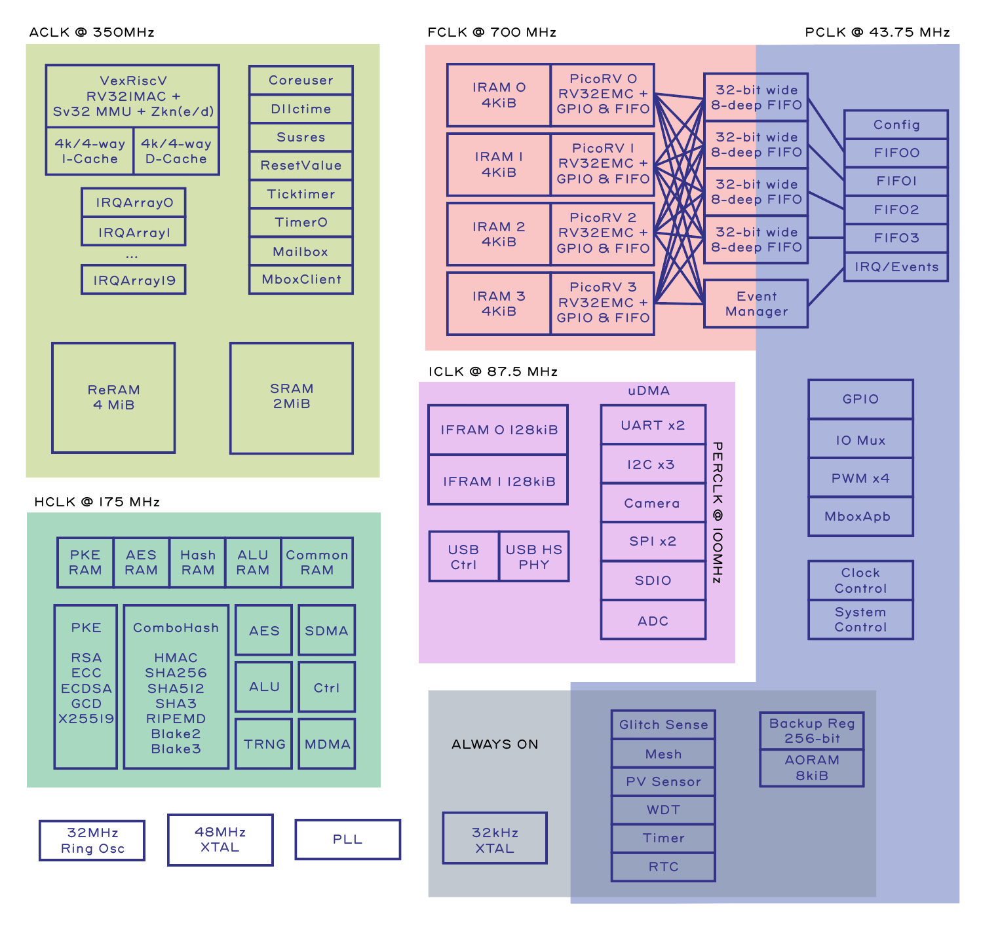

# Introduction

The Baochip-1x is an SoC with enhanced open source and security features. Fabricated
in TSMC22ULL, it has a 350MHz Vexriscv RV32-IMAC CPU with Sv39 (virtual memory) support,
along with 2MiB of integrated SRAM and 4MiB of integrated RRAM. RRAM is non-volatile
memory analogous to FLASH.

The full part number is BAO1X2S4F-WA, but the part is referred to as the "Baochip-1x"
or the "bao1x" interchangeably.

This book is a work in progress.

Please join the [Discord](https://discord.gg/YTCTZBTPNa) to request sections, or open a pull request to make edits and contributions. See [RTL](ch00-00-rtl-overview.md) for where to find the source code for the chip.

## Potential Topics

Below is a list of potential topics for supplemental documentation. Note that many of the sections already have sample code in [xous-core](https://github.com/betrusted-io/xous-core/), and all the sections already have automatically-extracted documentation ([Peripherals](https://ci.betrusted.io/bao1x/), [CPU](https://ci.betrusted.io/bao1x-cpu/)) with embedded links to the chip source code.

- clock generator
- PLL
- UDMA
  - UART
  - SPIM
  - I2C
  - SDIO
  - Camera
- Cryptoprocessors
  - SCERAM
  - Global setup
  - SDMA
  - Hash processor
  - PKE
  - AES
  - RNG
  - ALU
  - Sensors & countermeasures
- ATimer
- Always-on domain
- Power management & control
- RTC
- Keypad controller
- PWM
- Reset controller
- Interrupts/events
- CPU
- SRAM
- ReRAM
- watchdog timer
- DUART
