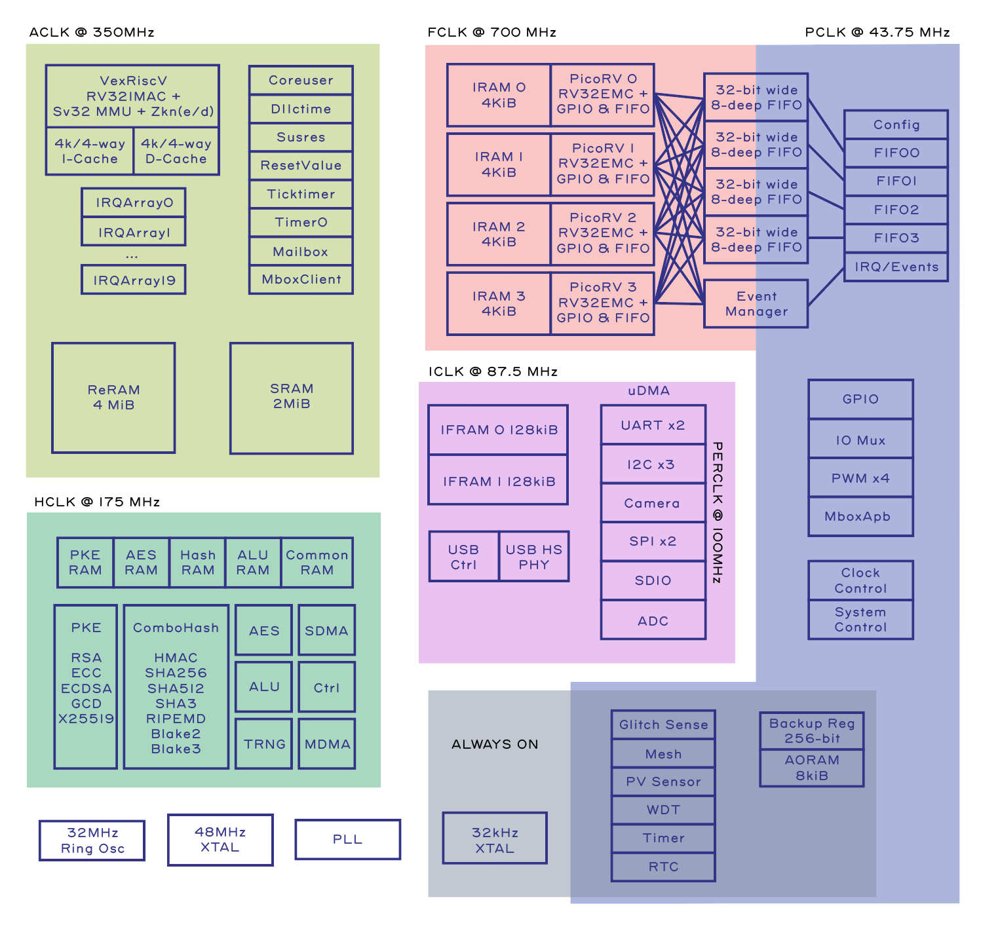

# Introduction

The Baochip-1x is an SoC with enhanced open source and security features. Fabricated
in TSMC22ULL, it has a 400MHz Vexriscv RV32-IMAC CPU with Sv39 (virtual memory) support,
along with 2MiB of integrated SRAM and 4MiB of integrated RRAM. RRAM is non-volatile
memory analogous to FLASH.

The full part number is BAO1X2S4F-WA, but the part is referred to as the "Baochip-1x"
or the "bao1x" interchangeably.

This book is a work in progress.

