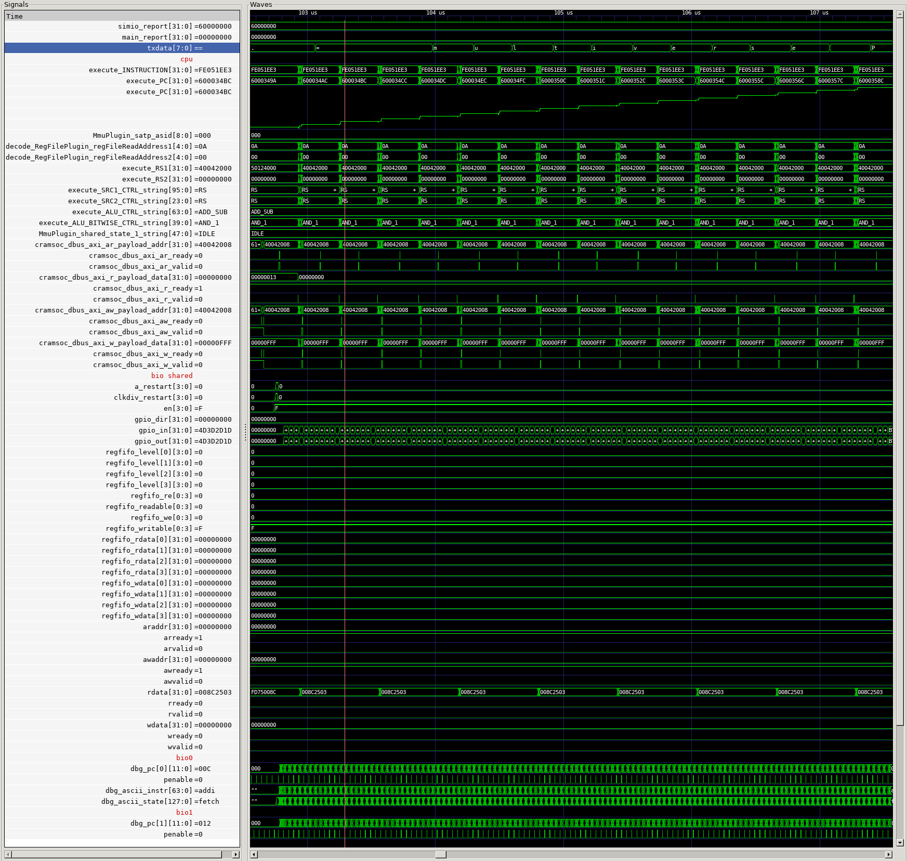
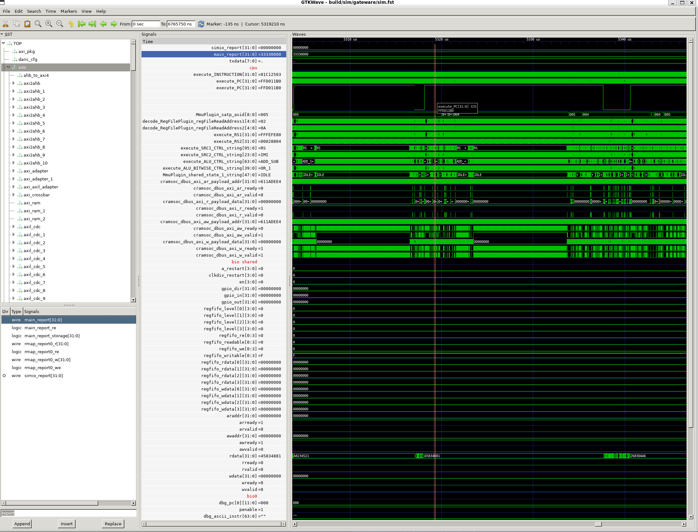
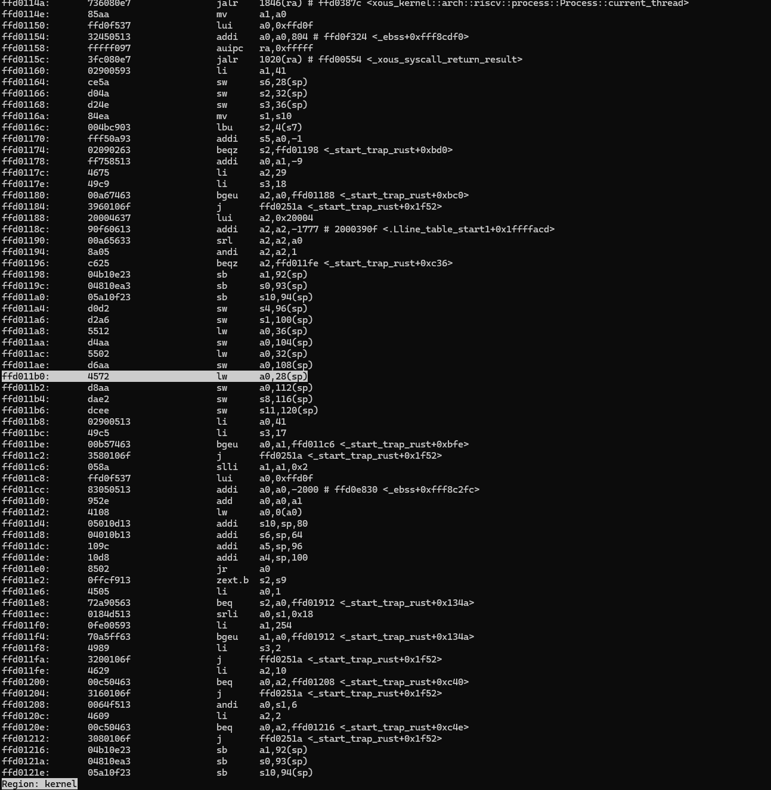
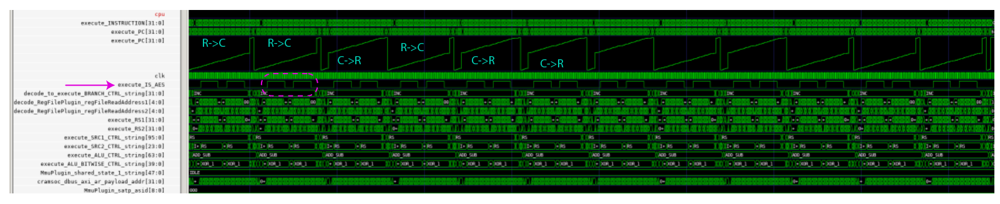
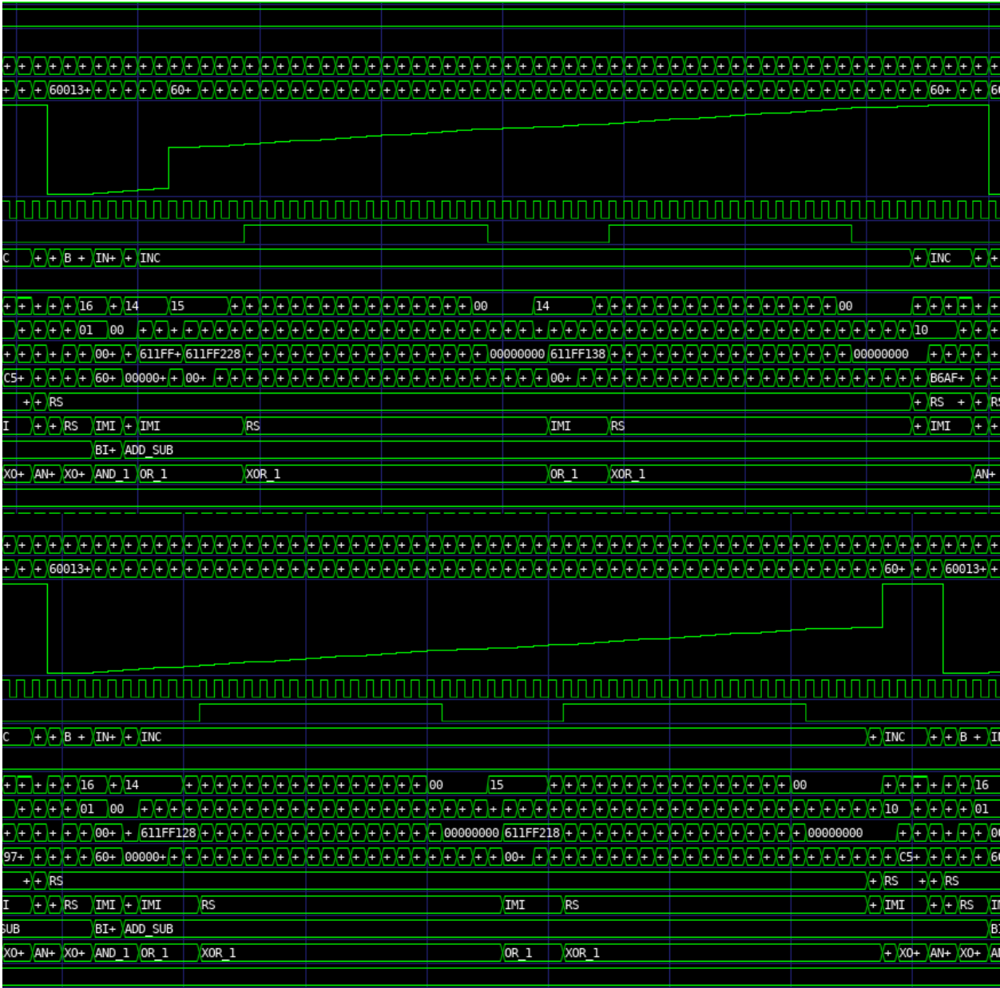
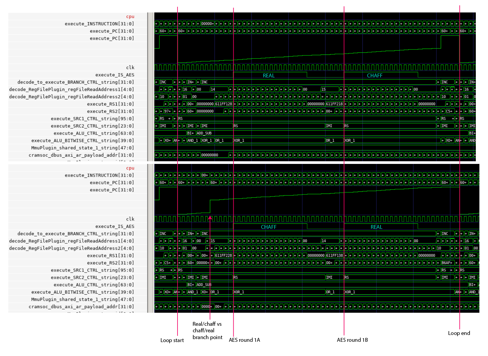

# Chip Source Code: RTL

RTL (Register Transfer Logic) refers to the "source code" for the Baochip-1x. It is mostly written in verilog/systemverilog, with parts derived from SpinalHDL (Scala) and Litex (Python).

While the RTL description of the Baochip-1x redacts some closed-source components, it is complete enough to be useful for automatic documentation generation and functional simulation. This chapter describes how to do both.

## Automatic Documentation & Header Generation

The following artifacts can be extracted directly from the RTL:

- xous-core [header file](https://github.com/betrusted-io/xous-core/blob/main/utralib/src/generated/bao1x.rs).
- A set of [C header files](https://github.com/baochip/baochip-1x/blob/main/rtl/scripts/headergen/output/bao1x_peri.h)
- Partial [SVD file](https://github.com/baochip/baochip-1x/blob/main/rtl/scripts/headergen/output/bao1x_peri.svd) describing the SoC peripherals. The rest of the SVD file is generated by Litex upon compiling the CPU core complex.
- Human-readable [SoC documentation](https://ci.betrusted.io/bao1x/)

Header generation is accomplished by running [`rtl_to_svd.py`](https://github.com/baochip/baochip-1x/blob/main/rtl/scripts/headergen/rtl_to_svd.py) like this from within the `rtl/scripts/headergen` directory:

```python
python3 ./rtl_to_svd.py --path ../../
```

This invocation will automatically generate and place all of the documentation inside the `rtl/scripts/headergen/output` directory. This directory is what is made available at the [baochip on-line register docs](https://ci.betrusted.io/bao1x/). **Note**: the script has a whole pile of dependencies, which are not well documented. Pull requests to this documentation are welcome to help fix that deficiency.

Furthermore, the SVD file generated by this script is exported to `xous-core` and then run through `svd2utra` to generate the [UTRA header file](https://github.com/betrusted-io/xous-core/blob/main/utralib/src/generated/bao1x.rs) abstractions found in Xous.

## Simulation with Verilator

Verilator is an open source verilog simulator that's capable of doing a fairly accurate simulation of the Baochip-1x SoC. The simulator favors performance over accuracy; in particular, it is incapable of representing the `X` (unknown) logic state. This isn't a liability for end users because during tape-out, the SoC was thoroughly vetted for `X` propagatation issues using a more accurate but slower proprietary simulator (VCS).

The upshot is that verilator is an extremely powerful tool for debugging software on the Baochip-1x. Below is a screenshot of a typical debugging session using verilator. In this example, we're examining some details of the BIO executing code. Note how we can view the debug UART output on the third line (`txdata`). The stepped, upward-sloping line is the program counter value plotted as an "analog" waveform (the code is just stepping through a the print of the string "multiverse"). You can also see the details of the register file accesses on the CPU, data on the AXI bus, GPIO pin state changes, and also which instruction is running on the BIO core and its respective execution state near the bottom. This is just a tiny portion of the visibility you can have into the machine function - literally thousands of waveforms are accessible in this tool.



Verilator captures the entire state evolution of the Baochip-1x as it runs your code, so you can go forward and backward in execution history, and you can inspect every register, bus, and signal inside the chip.

The waveform viewer shown above is GTKWave, [built from a fork](https://github.com/bunnie/gtkwave/tree/udp-send) that adds the "codezoom" feature. Codezoom allows you to hover over a the program counter trace of a verilator simulation and automatically resolve the assembly code that's running on the CPU. It works by forwarding some hard-coded trace parameters over UDP to the localhost, which can be picked up by a Python script. Clicking on a waveform "show mouseover" turned on looks like this (note the current PC value is displayed in a hover window):



And this results in the codezoom script showing you what instruction is at that program counter value in real time:



Here's a video of it in action ([download the video](https://bunniefoo.com/baochip/codezoom.mp4)):

<video controls width="1024">
  <source src="https://bunniefoo.com/baochip/codezoom.mp4" type="video/mp4">
  Your browser does not support the video tag.
</video>

This is particularly handy for tracing own hard-to-catch bugs, especially ones that change when instrumentation is applied that may affect timing of execution.

### Methodology

Verilator does not literally run the top level RTL file that describes the Baochip-1x, because some portions such as the AXI bus fabric, analog/mixed-signal IP (PLL, USB, regulators, ADC) and details of the built-in self test routines are closed source. Instead, a version of the chip is created in Litex, a Python framework for describing SoCs, which uses the same Vexriscv core complex and general bus architecture as the Baochip-1x. Select peripherals of the SoC are ported into this framework, and simulation stubs are created that target these peripherals. Currently the best-supported and tested stub is for the BIO, but there are also frameworks for debugging UDMA peripherals (although these have almost certainly bit-rotted by now).

Verilator is fast enough to boot the Xous OS in a reasonable amount of time (a couple minutes without waveform tracing; about 15 minutes with). This speed is over 10x faster than simulations run using the "gold standard" VCS tool; what you gain in speed you lose in accuracy (verilator is purely functional and does not consider timing or X-propagation).

Thus in the tape-out flow, verilator flow was to "rough out" IP blocks, assist with code development, and run large, complicated CI tests that would be impractical to run using the VCS tool. A select subset of tests are then run using VCS on the full SoC with all the proprietary blocks and detailed timing models of the chip that consider process, voltage and temperature. The VCS test cases are chosen to exercise correct power-on reset initialization (a significant challenge on real silicon, due to the `x` state being "real") and maximal coverage for minimum runtime. Once the blocks pass test on VCS, the code meets verilator's assumptions, allowing it to be used as a fast, open-source code simulator.

Thus, while the verilator models presented here are not perfectly cycle-accurate, they were accurate enough for chip development and reflects an important and significant portion of the actual development flow used in building and validating the Baochip-1x.

### Setting up Verilator

`Verilator 5.007 devel rev v5.006-30-g7f3e178b6` was used for simulation. Newer versions may work just fine, but they have not been tested. If your OS has a verilator package, be sure to run `verilator --version` and check that it is recent enough. Verilator is open source and you can [download & build it from github](https://github.com/verilator/verilator).

`GTKwave` was used for waveform viewing. A [custom fork](https://github.com/bunnie/gtkwave/tree/udp-send) (`udp-send`) of `v3.4.0` is required to support the "codezoom" feature documented here.

Once you have built and installed these tools, you should be able to run the script at [`./verilate/verilate.sh`](https://github.com/baochip/baochip-1x/blob/main/verilate/verilate.sh). This shell script supports the following arguments:

- `-t [xous, iron]`. Defaults to `iron`. `iron` runs the code base in `deps/nto-tests`. `xous` runs the code base in `deps/xous-core` built for the `bao1x-sim` target.
- `s [normal, fast]`. Defaults to `normal`. `fast` runs ~5x faster, but does not save a waveform file. However, it does print debug uart statements to the console. Thus `fast` is useful as a CI check that previously vetted simulations are still working, assuming you have populated your code with debug statements and checks for this.

`nto-tests` is the actual test code used to validate the portions of the Baochip-1x that were contributed by bunnie. It runs in a "baremetal" environment and has about a dozen configurable tests.

`xous-core` is the Xous OS, which can be configured with "shortcuts" (through the `hwsim` and `verilator-only` features) that shorten simulation runtime. Most of the "shortcuts" involve skipping zero-initializations because verilator guarantees all memory is 0 by default (unlike real hardware where it could truly be any value).

Under the hood, the `verilate.sh` script will:

- Build an SVD SoC description from LiteX
- Pass the SoC description to the Rust target (`nto-tests` or `xous-core`)
- Build & stage a runnable binary using Rust
- Extract assembly code listings usable with codezoom (placed in the `listings` directory)
- Invoke the SoC description again with Litex, this time using its built-in Verilator support to invoke the simulation

On `nto-tests`, the simulation will automatically terminate in many cases due to some specialty tooling added to the SoC model. `xous-core` requires you to control-C out when you've collected enough data. Note that `verilator` has a little bit of a buffering delay on writing waveform data, so it's always a good idea to let it run for about 15 seconds longer than you need it to, to ensure that the aspect of interest is actually written to the waveform file.

Once the simulation is done, you can view the results by running [`gtkw_run.sh`](https://github.com/baochip/baochip-1x/blob/main/verilate/gtkw_run.sh). This script will invoke GTKwave with a save file that will pre-populate some useful signals. Keep in mind there are literally tens of thousands of signals inside the chip, so what you see is just a small subset of what you can view. Think of it as a starting point for your debugging experience. It also configures GTKwave to pipe the necessary data to UDP so that you can run with `codezoom`.

To use the `codezoom` feature, run `python3 ./codezoom.py --file ../listings/<your-crate.lst>` in the `verilate` directory, on the same host that you're running GTKwave on. Then, in GTKWave, select `View->Show Mouseover`. Once this is enabled, left-clicking on the "analog waveform" in the viewer (which is the Program Counter (PC) value) will cause the PC value to be piped into the `codezoom` python script. The script will then automatically show you the code at that PC value.

The script is "Xous-aware", which allows you to debug transitions between kernel and userspace for a single process. The process must correspond to the one specified by the `--file` argument; the kernel file is automatically set up and resolved by the helper scripts in the verilate direcotry. Clicking on the PC in unrelated processes will simply show you that PC offset in the file you specified to codezoom; thus the results for other processes are gibberish.

### Example: Checking Constant Time Code with Verilator

A use case for running code simulations is checking the constant-time properties of cryptographic code. Below is an example of a simulation of an AES library which uses the Zkn extensions to compute rounds of AES on the CPU. A technique called "chaffing" is employed, where alternate rounds compute either real then fake, or fake then real data to try and mask the power side channel of the computation.



Above is an overview of the chaffing concept. In the image, call your attention to the waveform of `execute_IS_AES`. This is a signal that indicates that the instruction being executed is an AES instruction. Furthermore, observe the shape of the program counter waveform. There are two code paths, `real->chaff`, and `chaff->real`. `real->chaff` comes first in the code, and thus occupies a lower address in program memory; `chaff->real` comes later in the code, and requires a branch to reach it, and occupies the higher addresses in program memory.



Above is a simulation showing the initial cut at constant time code, where a branch delay penalty jumping to the higher address path was not compensated for correctly.



Above is the final simulation, confirming that the code is now in fact constant time, thanks to `nop` delays inserted into the pipeline on the branch-not-taken path. Because the Vex has no branch prediction, we don't have to worry about the branch predictor; however, if this was a more sophisticated architecture you could also examine the state of the branch predictor and confirm that it was "warmed up" correctly by prior code to ensure correct constant time execution.
