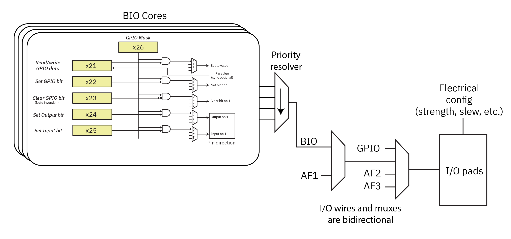

# I/O Configuration

## Muxing Overview

Baochip-1x I/O pads can be configured to numerous functions. The diagram below illustrates the overall scheme for banking.

The physical I/O pads' characteristics are configured by registers `GPIOPU` (for pull-ups) and `GPIOCFG` (for slew rate, drive strength, and schmitt trigger enable).

A bi-directional "primary" I/O mux connects the pads to any of GPIO, AF1, AF2, and AF3 peripheral logic options. AF1 is further selectable between BIO and AF1 functions using the `BIOSEL` register at 0x200. When selected, the BIO will override the "output enable" control for the pad.

The BIO pins are designated as BIO[31:0] and they map to ports B/C as `BIO[31:0] <-> {PC[15:0],PB[15:0]}`.

## GPIO Interface

See [hardware specifications](./ch01-00-electrical-specifications.md#pinout) for the I/O mapping table.

Function 0 is the GPIO base function. PA04–PA07 support an ADC.

Note that when KP (keypad) functions are selected on PF, their function overrides any other setting, and can conflict with PA settings on pads where PF and PA are tied together. This is because the KP functions are available even when the CPU core is powered down and the pinmux is invalid due to the pinmux power domain being turned off.

### GPIO Main Features

- Output states: push-pull or open drain + pull-up/down (`GPIOPUx`).
- Output data from output data register (`GPIOOUTx`).
- Input states: floating, pull-up/down.
- Input data to input data register (`GPIOINx`).
- Alternate function selection registers (`AFSELx`).
- Highly flexible pin multiplexing allows the use of I/O pins as GPIOs or as one of several peripheral functions — see pin map table above.

### GPIO Interrupts

- All ports have external interrupt capability. To use external interrupt lines, the port must be configured in input mode.
- Configurable interrupt or wakeup (signals from I/Os or peripherals able to generate a pulse). Selectable active trigger edge or level:
  - Rise edge
  - Fall edge
  - High level
  - Low level
- 8 interrupts (`INTCR0`–`INTCR7`)
- NVIC IRQn: 144

## GPIO Registers

Base address: `0x5012_F000`

| Register Name | Offset | Size | Type | Access | Default | Description |
|---------------|--------|------|------|--------|---------|-------------|
| AFSELAL | 0x0000 | 16 | CR | W/R | 0x00000000 | Port A pins 0–7 alternate function |
| AFSELAH | 0x0004 | 16 | CR | W/R | 0x00000000 | Port A pins 8–15 alternate function |
| AFSELBL | 0x0008 | 16 | CR | W/R | 0x00000000 | Port B pins 0–7 alternate function |
| AFSELBH | 0x000C | 16 | CR | W/R | 0x00000000 | Port B pins 8–15 alternate function |
| AFSELCL | 0x0010 | 16 | CR | W/R | 0x00000000 | Port C pins 0–7 alternate function |
| AFSELCH | 0x0014 | 16 | CR | W/R | 0x00000000 | Port C pins 8–15 alternate function |
| AFSELDL | 0x0018 | 16 | CR | W/R | 0x00000000 | Port D pins 0–7 alternate function |
| AFSELDH | 0x001C | 16 | CR | W/R | 0x00000000 | Port D pins 8–15 alternate function |
| AFSELEL | 0x0020 | 16 | CR | W/R | 0x00000000 | Port E pins 0–7 alternate function |
| AFSELEH | 0x0024 | 16 | CR | W/R | 0x00000000 | Port E pins 8–15 alternate function |
| AFSELFL | 0x0028 | 16 | CR | W/R | 0x00000000 | Port F pins 0–7 alternate function |
| AFSELFH | 0x002C | 16 | CR | W/R | 0x00000000 | Port F pins 8–15 alternate function |
| INTCR0 | 0x0100 | 16 | CR | W/R | 0x00000000 | IO interrupt 0 control register |
| INTCR1 | 0x0104 | 16 | CR | W/R | 0x00000000 | IO interrupt 1 control register |
| INTCR2 | 0x0108 | 16 | CR | W/R | 0x00000000 | IO interrupt 2 control register |
| INTCR3 | 0x010C | 16 | CR | W/R | 0x00000000 | IO interrupt 3 control register |
| INTCR4 | 0x0110 | 16 | CR | W/R | 0x00000000 | IO interrupt 4 control register |
| INTCR5 | 0x0114 | 16 | CR | W/R | 0x00000000 | IO interrupt 5 control register |
| INTCR6 | 0x0118 | 16 | CR | W/R | 0x00000000 | IO interrupt 6 control register |
| INTCR7 | 0x011C | 16 | CR | W/R | 0x00000000 | IO interrupt 7 control register |
| INTFR | 0x0120 | 16 | FR | W/R | 0x00000000 | IO interrupt flag register |
| GPIOOUTA | 0x0130 | 16 | CR | W/R | 0x00000000 | GPIO output control register — Port A |
| GPIOOUTB | 0x0134 | 16 | CR | W/R | 0x00000000 | GPIO output control register — Port B |
| GPIOOUTC | 0x0138 | 16 | CR | W/R | 0x00000000 | GPIO output control register — Port C |
| GPIOOUTD | 0x013C | 16 | CR | W/R | 0x00000000 | GPIO output control register — Port D |
| GPIOOUTE | 0x0140 | 16 | CR | W/R | 0x00000000 | GPIO output control register — Port E |
| GPIOOUTF | 0x0144 | 16 | CR | W/R | 0x00000000 | GPIO output control register — Port F |
| GPIOOEA | 0x0148 | 16 | CR | W/R | 0x00000000 | GPIO output enable control register — Port A |
| GPIOOEB | 0x014C | 16 | CR | W/R | 0x00000000 | GPIO output enable control register — Port B |
| GPIOOEC | 0x0150 | 16 | CR | W/R | 0x00000000 | GPIO output enable control register — Port C |
| GPIOOED | 0x0154 | 16 | CR | W/R | 0x00000000 | GPIO output enable control register — Port D |
| GPIOOEE | 0x0158 | 16 | CR | W/R | 0x00000000 | GPIO output enable control register — Port E |
| GPIOOEF | 0x015C | 16 | CR | W/R | 0x00000000 | GPIO output enable control register — Port F |
| GPIOPUA | 0x0160 | 16 | CR | W/R | 0x0000FFFF | GPIO pull-up control register — Port A |
| GPIOPUB | 0x0164 | 16 | CR | W/R | 0x0000FFFF | GPIO pull-up control register — Port B |
| GPIOPUC | 0x0168 | 16 | CR | W/R | 0x0000FFFF | GPIO pull-up control register — Port C |
| GPIOPUD | 0x016C | 16 | CR | W/R | 0x0000FFFF | GPIO pull-up control register — Port D |
| GPIOPUE | 0x0170 | 16 | CR | W/R | 0x0000FFFF | GPIO pull-up control register — Port E |
| GPIOPUF | 0x0174 | 16 | CR | W/R | 0x0000FFFF | GPIO pull-up control register — Port F |
| GPIOINA | 0x0178 | 16 | Status | R | 0x00000000 | GPIO input status register — Port A |
| GPIOINB | 0x017C | 16 | Status | R | 0x00000000 | GPIO input status register — Port B |
| GPIOINC | 0x0180 | 16 | Status | R | 0x00000000 | GPIO input status register — Port C |
| GPIOIND | 0x0184 | 16 | Status | R | 0x00000000 | GPIO input status register — Port D |
| GPIOINE | 0x0188 | 16 | Status | R | 0x00000000 | GPIO input status register — Port E |
| GPIOINF | 0x018C | 16 | Status | R | 0x00000000 | GPIO input status register — Port F |
| BIOSEL | 0x0200 | 32 | CR | W/R | 0x00000000 | BIO select register |
| GPIOCFG_SCHMA | 0x0230 | 16 | CR | W/R | 0x00000000 | Input Schmitt trigger enable — Port A |
| GPIOCFG_SCHMB | 0x0234 | 16 | CR | W/R | 0x00000000 | Input Schmitt trigger enable — Port B |
| GPIOCFG_SCHMC | 0x0238 | 16 | CR | W/R | 0x00000000 | Input Schmitt trigger enable — Port C |
| GPIOCFG_SCHMD | 0x023C | 16 | CR | W/R | 0x00000000 | Input Schmitt trigger enable — Port D |
| GPIOCFG_SCHME | 0x0240 | 16 | CR | W/R | 0x00000000 | Input Schmitt trigger enable — Port E |
| GPIOCFG_SCHMF | 0x0244 | 16 | CR | W/R | 0x00000000 | Input Schmitt trigger enable — Port F |
| GPIOCFG_RATCLRA | 0x0248 | 16 | CR | W/R | 0x00000000 | Output slew rate control enable — Port A |
| GPIOCFG_RATCLRB | 0x024C | 16 | CR | W/R | 0x00000000 | Output slew rate control enable — Port B |
| GPIOCFG_RATCLRC | 0x0250 | 16 | CR | W/R | 0x00000000 | Output slew rate control enable — Port C |
| GPIOCFG_RATCLRD | 0x0254 | 16 | CR | W/R | 0x00000000 | Output slew rate control enable — Port D |
| GPIOCFG_RATCLRE | 0x0258 | 16 | CR | W/R | 0x00000000 | Output slew rate control enable — Port E |
| GPIOCFG_RATCLRF | 0x025C | 16 | CR | W/R | 0x00000000 | Output slew rate control enable — Port F |
| GPIOCFG_DRVSELA | 0x0260 | 32 | CR | W/R | 0x00000000 | Output drive current config — Port A |
| GPIOCFG_DRVSELB | 0x0264 | 32 | CR | W/R | 0x00000000 | Output drive current config — Port B |
| GPIOCFG_DRVSELC | 0x0268 | 32 | CR | W/R | 0x00000000 | Output drive current config — Port C |
| GPIOCFG_DRVSELD | 0x026C | 32 | CR | W/R | 0x00000000 | Output drive current config — Port D |
| GPIOCFG_DRVSELE | 0x0270 | 32 | CR | W/R | 0x00000000 | Output drive current config — Port E |
| GPIOCFG_DRVSELF | 0x0274 | 32 | CR | W/R | 0x00000000 | Output drive current config — Port F |

### Register Descriptions

#### AFSEL — Alternate Function Selection Register

- **Description:** I/O pad alternate function selection register
- **Address:** `0x0000 + (8 × X)` where X = 0–5 (Ports A–F)
- **Reset value:** `0x0000_0000`

Two bits are assigned per pin. For the low register (AFSELxL), bits [15:0] cover pins 0–7; for the high register (AFSELxH), bits [15:0] cover pins 8–15.

| Bits | Field | Description |
|------|-------|-------------|
| [1:0] per pin | AF select | `00` = GPIO, `01` = AF1, `10` = AF2, `11` = AF3 |

#### BIOSEL — BIO Function Selection Register

- **Description:** Connect I/O pad to BIO
- **Address:** `0x200`
- **Reset value:** `0x0000_0000`

A bit configured to `1` will cause the BIO to override the AF1 peripheral at that bit. The BIO has 32 bits of I/O mapped as BIO[0:31] = PB[0:15],PC[0:15].

| Bits | Field | Description |
|------|-------|-------------|
| [31:0] | BIO select | `1` selects BIO |

#### INTCR — IO Interrupt Control Register

- **Description:** IO interrupt control register
- **Address:** `0x0100 + (4 × X)` where X = 0–7
- **Reset value:** `0x0000_0000`

| Bits | Field | Description |
|------|-------|-------------|
| [6:0] | intsel | IO pin selection (supports up to 82 IO pins, PA0–PF9) |
| [8:7] | intmode | Interrupt trigger: `00` = rise edge, `01` = fall edge, `10` = high level, `11` = low level |
| [9] | inten | Interrupt enable: `1` = enabled, `0` = disabled |
| [10] | wkupe | Wakeup enable: `1` = enabled, `0` = disabled |

#### INTFR — IO Interrupt Flag Register

- **Description:** IO interrupt flag register
- **Address:** `0x0120`
- **Reset value:** `0x0000_0000`

Write `1` to a bit to clear it.

| Bits | Field | Description |
|------|-------|-------------|
| [0] | IT7 | INTCR7 interrupt generated |
| [1] | IT6 | INTCR6 interrupt generated |
| [2] | IT5 | INTCR5 interrupt generated |
| [3] | IT4 | INTCR4 interrupt generated |
| [4] | IT3 | INTCR3 interrupt generated |
| [5] | IT2 | INTCR2 interrupt generated |
| [6] | IT1 | INTCR1 interrupt generated |
| [7] | IT0 | INTCR0 interrupt generated |

#### GPIOOUT — GPIO Output Control Register

- **Description:** GPIO output control register
- **Address:** `0x0130 + (4 × X)` where X = 0–5 (Ports A–F)
- **Reset value:** `0x0000_0000`

| Bits | Field | Description |
|------|-------|-------------|
| [15:0] | OUT | Output value for each pin in Port x |

#### GPIOOE — GPIO Output Enable Control Register

- **Description:** GPIO output enable control register
- **Address:** `0x0148 + (4 × X)` where X = 0–5 (Ports A–F)
- **Reset value:** `0x0000_0000`

| Bits | Field | Description |
|------|-------|-------------|
| [15:0] | OE | Output enable for each pin in Port x: `1` = output, `0` = input |

#### GPIOPU — GPIO Pull-Up Configuration Register

- **Description:** GPIO pull-up configuration register
- **Address:** `0x0160 + (4 × X)` where X = 0–5 (Ports A–F)
- **Reset value:** `0x0000_FFFF` (all pull-ups enabled by default)

| Bits | Field | Description |
|------|-------|-------------|
| [15:0] | PU | Pull-up enable for each pin in Port x: `1` = pull-up enabled |

#### GPIOIN — GPIO Input Status Register

- **Description:** GPIO input status register (read-only)
- **Address:** `0x0178 + (4 × X)` where X = 0–5 (Ports A–F)
- **Reset value:** `0x0000_0000`

| Bits | Field | Description |
|------|-------|-------------|
| [15:0] | IN | Current input state for each pin in Port x |

#### GPIOCFG_SCHM — Input Schmitt Trigger Enable Register

- **Description:** GPIO input Schmitt trigger enable register
- **Address:** `0x0230 + (4 × X)` where X = 0–5 (Ports A–F)
- **Reset value:** `0x0000_0000`

| Bits | Field | Description |
|------|-------|-------------|
| [15:0] | SCHM | Schmitt trigger enable for each pin in Port x: `1` = enabled |

#### GPIOCFG_RATCLR — Output Slew Rate Control Register

- **Description:** GPIO output slew rate control enable register
- **Address:** `0x0248 + (4 × X)` where X = 0–5 (Ports A–F)
- **Reset value:** `0x0000_0000`

| Bits | Field | Description |
|------|-------|-------------|
| [15:0] | RATCLR | Slew rate control enable for each pin in Port x: `1` = enabled |

#### GPIOCFG_DRVSEL — Output Drive Current Configuration Register

- **Description:** GPIO output drive current configuration register
- **Address:** `0x0260 + (4 × X)` where X = 0–5 (Ports A–F)
- **Reset value:** `0x0000_0000`

Two bits are assigned per pin (32-bit register, covering all 16 pins per port).

| Bits [1:0] per pin | Drive current |
|--------------------|---------------|
| `2'b00` | 2 mA |
| `2'b10` | 4 mA |
| `2'b01` | 8 mA |
| `2'b11` | 12 mA |
