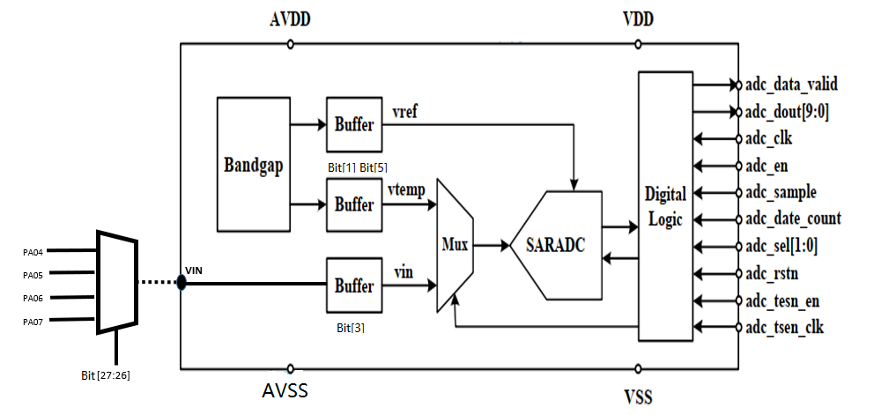
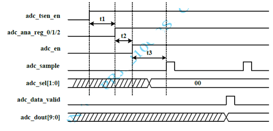
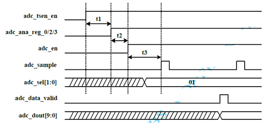
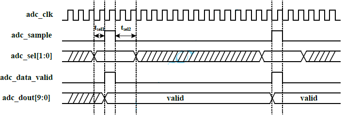

# ADC

## Analog to Digital Converter (ADC)

### ADC Introduction

- ADC module supports temperature and voltage measurement.
- The ADC is a 10-bit successive approximation analog-to-digital converter.
- Generates a voltage varying linearly with junction temperature, -40°C to 125°C.
- The Bandgap generates Vreference and Vtemperature, which are converted into digital output by SARADC.
- ADC calculation: `VIN = dout / 1023 * Vbg`
  - e.g. at 25°C: `VIN = (516 / 1023) * 1.208 = 0.609 V`
- VIN: sample voltage input via PORT A Function 0:
  - PA04: ADC0
  - PA05: ADC1
  - PA06: ADC2
  - PA07: ADC3

### ADC Main Features

**Key parameters:**

- Conversion rate up to 100 KS/s; each conversion costs at least 14 clock cycles.
- Conversion rate can be adjusted by changing the clock frequency or increasing the clock cycles per conversion.
- Clock frequency base: 16 MHz.
- `adc_tsen_clk` (Bandgap clock): 8 MHz to 16 MHz.
- `adc_clk` (ADC clock): 0.2 MHz to 1.6 MHz.

**DC Characteristics:**

| Parameter | Symbol | Min | Typ | Max | Unit |
|-----------|--------|-----|-----|-----|------|
| Temperature range | — | -40 | — | 125 | °C |
| Temperature resolution | — | — | 0.6 | — | °C |
| Temperature accuracy | — | -4 | — | +4 | °C |
| Voltage reference | VBG | — | 1.208 | — | V |
| Voltage input range | VIN | 0.3 | — | 1.0 | V |
| Voltage resolution | — | — | 0.3 | — | mV |
| Voltage accuracy | — | -10 | — | +10 | mV |
| ADC resolution | — | — | 10 | — | Bit |
| Effective number of bits | ENOB | — | 9 | — | Bit |
| Differential nonlinearity | DNL | -1 | — | +1 | LSB |
| Integral nonlinearity | INL | -2 | — | +2 | LSB |

**DMA:** 1 RX channel.

## Operation Modes

### Temperature Sensor

To start the temperature sensor, the bandgap circuit, the related voltage buffers, and ADC should be enabled successively.

### Voltage Measurement

To start voltage measurement, the external voltage buffer should be turned on instead of the temperature-related voltage buffer, and `adc_sel[1:0]` should be set to `2'b01` to select the external voltage input for ADC.

### Start Timing Specification

| Parameter | Min | Typ | Max |
|-----------|-----|-----|-----|
| t1 | 10 µs | — | — |
| t2 | 0 µs | — | — |
| t3 | 90 µs | — | — |

The ADC starts conversion when `adc_sample` goes high and requires 14 clock cycles to complete. When conversion is complete, `adc_data_valid` is set high at the 15th clock cycle for one clock cycle. The result `adc_dout[9:0]` also becomes valid at the 15th clock cycle and remains valid until the next conversion completes.

## Table for Temperature Output

| Temperature | Temperature Sensor Output (Typ) |
|-------------|----------------------------------|
| -40°C | 627 |
| -35°C | 619 |
| -30°C | 610 |
| -25°C | 601 |
| -20°C | 593 |
| -15°C | 584 |
| -10°C | 576 |
| -5°C | 568 |
| 0°C | 560 |
| 5°C | 551 |
| 10°C | 542 |
| 15°C | 534 |
| 20°C | 525 |
| 25°C | 516 |
| 30°C | 508 |
| 35°C | 500 |
| 40°C | 492 |
| 45°C | 483 |
| 50°C | 474 |
| 55°C | 466 |
| 60°C | 458 |
| 65°C | 449 |
| 70°C | 440 |
| 75°C | 432 |
| 80°C | 423 |
| 85°C | 415 |
| 90°C | 407 |
| 95°C | 398 |
| 100°C | 389 |
| 105°C | 380 |
| 110°C | 372 |
| 115°C | 363 |
| 120°C | 354 |
| 125°C | 346 |

## ADC Interrupts

Each ADC module supports 1 interrupt:

- `s_rx_ch_events`: DMA RX channel receive buffer full
- NVIC IRQn: 121

## ADC Registers

Base address: `0x5011_4000`

| Register Name | Offset | Size | Type | Access | Default | Description |
|---------------|--------|------|------|--------|---------|-------------|
| ADC_RX_SADDR | 0x0000 | 32 | Config | R/W | 0x00000000 | RX buffer base address configuration register |
| ADC_RX_SIZE | 0x0004 | 32 | Config | R/W | 0x00000004 | RX buffer size configuration register |
| ADC_RX_CFG | 0x0008 | 32 | Config | R/W | 0x00000000 | RX stream configuration register |
| ADC_CR_CFG | 0x0010 | 32 | Config | R/W | 0x00000000 | ADC control configuration register |

### Register Descriptions

#### ADC_RX_SADDR — RX Buffer Base Address

- **Address offset:** `0x0000`
- **Reset value:** `0x0000_0000`

| Bits | Field | Access | Description |
|------|-------|--------|-------------|
| [15:0] | RX_SADDR | R/W | RX buffer base address. Read: returns current buffer pointer value during transfer, else 0. Write: sets RX buffer base address. |

#### ADC_RX_SIZE — RX Buffer Size

- **Address offset:** `0x0004`
- **Reset value:** `0x0000_0004`

| Bits | Field | Access | Description |
|------|-------|--------|-------------|
| [16:0] | RX_SIZE | R/W | RX buffer size in bytes (max 1 MByte). Read: returns remaining bytes to transfer. Write: sets buffer size. |

#### ADC_RX_CFG — RX Stream Configuration

- **Address offset:** `0x0008`
- **Reset value:** `0x0000_0000`

| Bits | Field | Access | Description |
|------|-------|--------|-------------|
| [5] | PENDING | R/W | RX transfer pending status: `0` = no pending transfer, `1` = pending transfer in queue |
| [4] | EN | R/W | RX channel enable and start: `0` = disable, `1` = enable and start transfer. Also used to queue a transfer if one is already ongoing. |
| [2:1] | DATASIZE | R/W | Channel transfer size for uDMA buffer address increment. `10` (const) = +4 (32-bit) |
| [0] | CONTINOUS | R/W | Continuous mode: `0` = disabled, `1` = enabled. When enabled, the uDMA reloads the address and buffer size and starts a new transfer at the end of each buffer. |

#### ADC_CR_CFG — ADC Control Configuration

- **Address offset:** `0x0010`
- **Reset value:** `0x0000_0000`

| Bits | Field | Access | Description |
|------|-------|--------|-------------|
| [7:0] | adc_ana_control | R/W | ADC IP register configuration (see bit detail below) |
| [12:8] | adc_data_count | R/W | ADC clock cycles per sample (must be ≥ 14) |
| [13] | adc_tsen_en | R/W | Bandgap enable: `0` = disable, `1` = enable |
| [14] | adc_en | R/W | ADC enable: `0` = disable, `1` = enable |
| [15] | adc_rstn | R/W | ADC reset: `0` = default, `1` = reset |
| [23:16] | adc_clkfd | R/W | ADC clock divider (base 16 MHz). `adc_clk = 16000 / adc_clkfd` kHz. Must yield a frequency between 0.2–1.6 MHz. e.g. `adc_clkfd = 80` → `adc_clk = 200 kHz`; `adc_clkfd = 10` → `adc_clk = 1600 kHz` |
| [25:24] | adc_sel | R/W | ADC input select: `00` = temperature-related voltage, `01` = external voltage |
| [27:26] | adc_vin_sel | R/W | Analog input mux: `00` = PA04 (ADC0), `01` = PA05 (ADC1), `10` = PA06 (ADC2), `11` = PA07 (ADC3) |

**`adc_ana_control` bit detail:**

| Bit | Description |
|-----|-------------|
| [0] | Bandgap chopper enable: `0` = disable, `1` = enable |
| [1] | Temperature-related voltage buffer: `0` = disable, `1` = enable |
| [2] | Bandgap voltage buffer: `0` = disable (use AVDD as reference), `1` = enable (use Bandgap voltage as reference) |
| [3] | External voltage buffer: `0` = disable, `1` = enable |
| [4] | Temperature-related voltage select: `0` = voltage 1, `1` = voltage 2 |
| [5] | Temperature-related voltage filter bypass: `0` = use filter, `1` = bypass filter |
| [6] | Bandgap voltage filter bypass: `0` = use filter, `1` = bypass filter |
| [7] | Reserved |
