# USB

## USB Interface

### USB Introduction

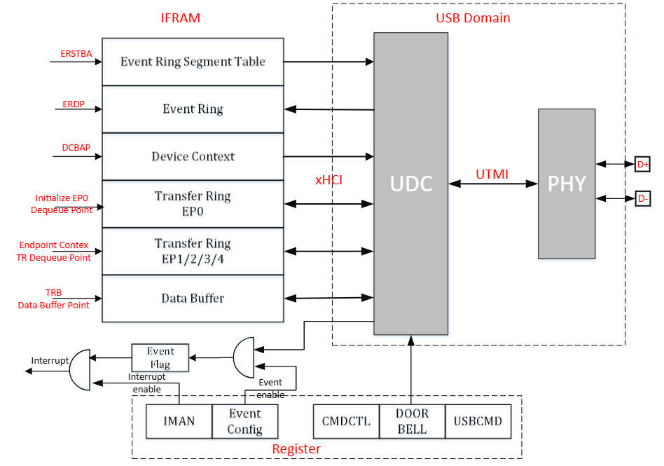

The UDC (USB device controller) uses an xHCI-like DMA model. There are two types of ring. A ring is a circular queue of TRB data structures used to pass TRBs from a producer to a consumer. Two pointers — Enqueue and Dequeue — are associated with each ring to identify where the producer will enqueue the next TRB and where the consumer will dequeue the next TRB.

A continuous area in IRAM is allocated for data exchange with the UDC.

- **Event Ring Segment Table:** The Event Ring Segment Table Size (ERSTSZ) register value is the number of segments described by the Event Ring Segment Table. The Event Ring Segment Table Base Address (ERSTBA) register points to the address of the Event Ring Segment Table.
- **Event Ring:** Used by UDC to return status and results of commands and transfers to system software. The EVENTCONFIG register enables corresponding events. The TRB Type field of an Event TRB indicates which event caused it. The Event Ring is pointed to by the Event Ring Dequeue Pointer (ERDP) register.
- **Device Context:** Consists of EP Contexts for Outbound and Inbound EPs. Device Contexts are pointed to by the Device Context Base Address Pointer (DCBAP) register.
- **Transfer Ring:** Used to move data between system memory buffers and UDC endpoints. There are 2 independent Transfer Rings for EP0 and EP1/2/3/4. The Initialize EP0 Command sets the pointer to the Transfer Ring for EP0. The Config EP Command loads EP Context to configure EPs.
- **Data Buffer:** Actual storage for exchange data. The data buffer address is contained in the Data Buffer Pointer field of a TRB.
- **Interrupt:** NVIC IRQn: 145. The Interrupt Management Register (IMAN) enables interrupts.
- **Doorbell:** A mechanism that actively notifies the UDC of data transmission. The Doorbell register indicates which endpoint needs to act.

### USB Main Features

- USB 2.0 Device-mode
  - Supports High Speed and Full Speed.
  - Supports Control, Bulk, and Interrupt transfer types.
  - Supports L1/L2 power saving modes for USB 2.0 port.
  - Supports 5 endpoints: EP0 supports Control Transfer; EP1/2/3/4 support Bulk and Interrupt Transfer.

## Event Ring

A fundamental difference between an Event Ring and a Transfer Ring is that the UDC is the producer and system software is the consumer of Event TRBs. The UDC writes Event TRBs to the Event Ring and updates the Cycle bit in the TRBs to indicate the current position of the Enqueue Pointer to software.

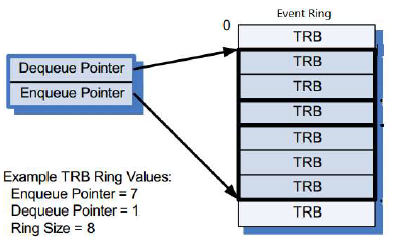

Software maintains an Event Ring Consumer Cycle State (CCS) bit, initializing it to `1` and toggling it every time the Event Ring Dequeue Pointer wraps back to the beginning of the Event Ring. If the Cycle bit of the Event TRB pointed to by the Dequeue Pointer equals CCS, the Event TRB is valid — software processes it and advances the Dequeue Pointer. If the Cycle bit does not equal CCS, software stops processing Event TRBs and waits for an interrupt from the UDC.

System software shall write the Event Ring Dequeue Pointer (ERDP) register to inform the UDC that it has completed processing Event TRBs up to and including the TRB referenced by the ERDP.

## Transfer Ring

Transfers to and from UDC endpoints are defined using a Transfer Descriptor (TD), which consists of one or more Transfer Request Blocks (TRBs). TDs are managed through Transfer Rings that reside in system memory. A Chain flag in the TRB is used to identify TRBs that comprise a TD — the Chain flag is set in all but the last TRB of a TD. A TD may consist of a single TRB, in which case the Chain flag shall not be set.

A Transfer Ring exists for each active endpoint or stream declared by a UDC.

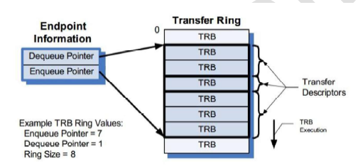

In the simplest case, software defines a Transfer Ring by allocating and initializing a memory buffer, then setting the Enqueue and Dequeue Pointers to the address of the buffer and writing it into the TRB Dequeue Pointer field of the associated Endpoint. A Transfer Ring is empty when the Enqueue Pointer equals the Dequeue Pointer.

> **Note:** The Transfer Ring Enqueue and Dequeue Pointers are not accessible through physical device controller registers. They are logical entities maintained internally by both system software and the device controller.

After a Transfer Ring is initialized, TDs (comprised of one or more TRBs) may be placed on it.

## Data Structures

### PEI Bitmap

PEI (Physical EP ID) bitmap is used by software to ring doorbell and request commands. EP0's PEI is 0, mapped to bit[0].

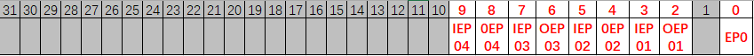

- **OEP:** Outbound EP (EP_In from Host perspective)
- **IEP:** Inbound EP (EP_Out from Host perspective)

### Device Contexts

Device Contexts are pointed to by the Device Context Base Address Pointer (DCBAP) register. They consist of EP Contexts for Outbound and Inbound EPs.

The first EP Context is for Outbound Physical EP 1 (PEI == 2), followed by Inbound Physical EP 1 (PEI == 3). When allocating memory for Device Contexts, software shall guarantee that it can accommodate all Physical EPs it intends to use.

EP0 does not have a corresponding EP Context. Its DQPTR, DCS, and MPS are set using the Command Interface.

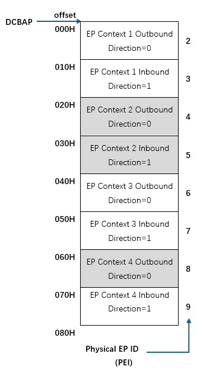

#### Endpoint Context

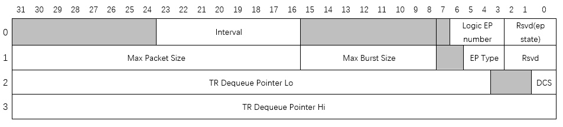

| Word | Bits | Field | Description |
|------|------|-------|-------------|
| 0 | [23:16] | Interval | Service interval calculated as 125 µs × 2^Interval |
| 0 | [6:3] | Logical EP Number | Logical EP Number assigned to a Physical EP |
| 1 | [31:16] | Max Packet Size (MPS) | Maximum packet size in bytes this EP can send or receive |
| 1 | [15:8] | Max Burst Size (MBS) | Maximum burst size. Value 0–15 represents burst size 1–16 |
| 1 | [5:3] | EP Type | `0` = Invalid, `2` = Outbound Bulk, `3` = Outbound Interrupt, `4` = Invalid, `6` = Inbound Bulk, `7` = Inbound Interrupt |
| 2 | [31:4] | TR Dequeue Pointer Lo (DQPTR) | Transfer Dequeue Pointer (low) |
| 2 | [0] | DCS | Device Context Start |
| 3 | [31:0] | TR Dequeue Pointer Hi | Reserved — set to 0 |

**Notes:**
- DQPTR and DCS are set by the **Initialize EP0** command.
- MPS is set by the **Update EP0** command.
- Other EPs are configured by the **Config EP** command, which makes the endpoint context configuration effective.

### TRB

A Transfer Request Block (TRB) is a data structure constructed in memory by software to transfer a single physically contiguous block of data between system memory and the UDC. TRBs contain a Data Buffer Pointer, the buffer size, and additional control information.

#### Transfer TRBs

**Normal TRB**

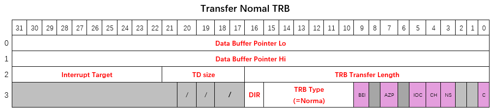

**Control Data Stage TRB**

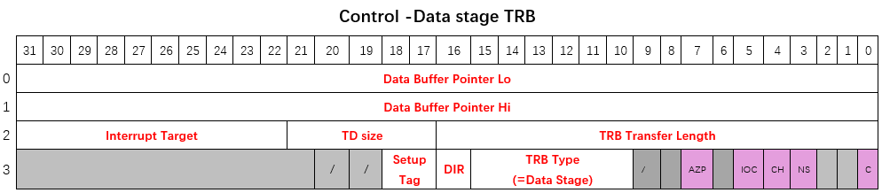

**Control Status Stage TRB**

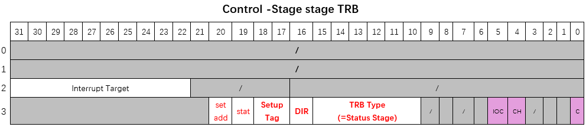

#### Event TRBs

**Transfer Event TRB**

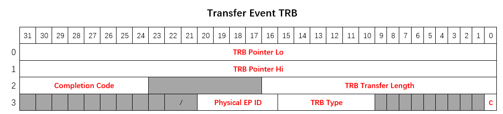

**Command Completion Event TRB**

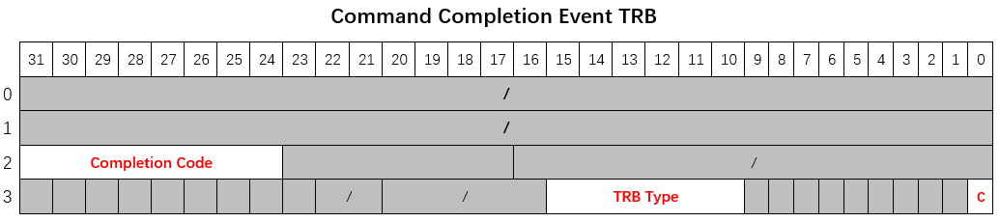

**Port Status Change Event TRB**

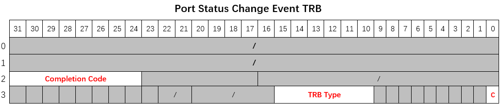

**Setup Event TRB**

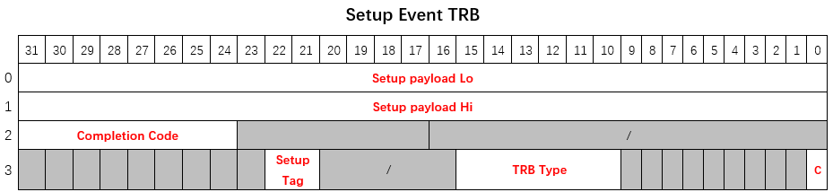

#### Link TRB

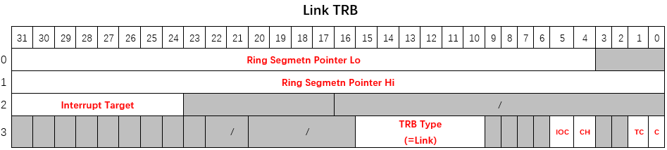

#### Event Ring Segment TRB

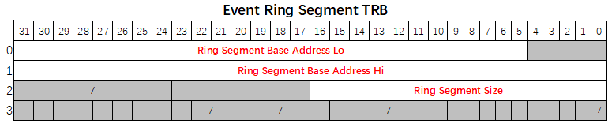

### TRB Fields

| Field | Description |
|-------|-------------|
| Data Buffer Pointer | Start address of the data buffer associated with this TRB |
| TRB Transfer Size | Size of data buffer in bytes |
| TD Size | Number of packets still to be transferred for the current TD after finishing this TRB. If Chain bit is 1 and residual bytes cannot form an MPS packet, they are added to the size of all following TRBs in the same TD. If more than 31 packets remain, set to 31. |
| Interrupt Target | Which event ring to use if the device needs to generate a Transfer Event for this TRB |
| TRB Type | Type of this TRB |
| Direction (Dir) | `0` = Outbound (host reads from device), `1` = Inbound (host writes to device) |
| Setup Tag | Associates EP0 TRBs with corresponding Setup Request. Software shall always use the Setup Tag value assigned by hardware in the Setup Event TRB. |
| Status | When set, instructs hardware to put EP0 in protocol stall state |
| Set Address | Indicates that the current Status Stage TRB is for Set Address |
| TRB Transfer Length | Number of bytes not yet transferred in the pointed TRB. Shall be ignored for Transfer Events generated for TRBs with IOC set while advancing to next TD. |
| Physical EP ID | Which Physical EP ID generated this event |
| Completion Code | Completion status of the pointed TRB. Shall be ignored for Transfer Events generated for TRBs with IOC set while advancing to next TD. |
| Setup Payload | Data payload of the received Setup packet |

### Control Bit Map

| Bit | Field | Description |
|-----|-------|-------------|
| 9 | Block Event Interrupt (BEI) | If set, the Transfer Event generated by IOC shall not assert an interrupt at the next interrupt threshold |
| 7 | AZP (Append Zero-length Packet) | May only be asserted in the last TRB of an Outbound EP's TD. Device controller will send one additional zero-length packet after finishing the current TD. Shall not be asserted in a zero-length TD. |
| 5 | Interrupt on Completion (IOC) | If set, UDC notifies software of TRB completion by generating a Transfer Event and asserting an interrupt at the next interrupt threshold |
| 4 | Chain bit (CH) | Set to 1 to associate this TRB with the next TRB on the Ring, making them part of the same TD |
| 3 | No Snoop (NS) | Reserved for future use |
| 1 | Toggle Cycle (TC) | If set, device toggles its interpretation of the cycle bit in the next ring segment |
| 0 | Cycle bit (C) | Used to mark the Enqueue Pointer of the transfer ring |

### TRB Type Encoding

| ID | TRB Type | Transfer Ring (Control) | Transfer Ring (Bulk/Interrupt) | Event Ring |
|----|----------|-------------------------|-------------------------------|------------|
| 1 | Normal TRB | Allowed | Allowed | — |
| 3 | Data Stage TRB | Allowed | — | — |
| 4 | Status Stage TRB | Allowed | — | — |
| 6 | Link TRB | Allowed | Allowed | — |
| 32 | Transfer Event TRB | — | — | Allowed |
| 33 | Command Completion Event TRB | — | — | Allowed |
| 34 | Port Status Change Event TRB | — | — | Allowed |
| 40 | Setup Event TRB | — | — | Allowed |

### Completion Code Encoding

| Value | Description |
|-------|-------------|
| 1 | Success |
| 4 | USB Transaction Error |
| 13 | Short Packet |
| 21 | Event Ring Full Error |
| 23 | Missed Service Error |
| 26 | Stopped |
| 27 | Stopped — Length Invalid |
| 192 | Protocol Stall Error |
| 193 | Setup Tag Mismatch Error |
| 194 | Halted |
| 195 | Halted — Length Invalid |
| 196 | Disabled Error |

## Command Interface

### Command Types

| Encoding | Command Type | Parameter Bits |
|----------|-------------|----------------|
| 0 | Initialize EP0 | [63:4] DQPTR; [0] DCS |
| 1 | Update EP0 Config | [15:0] Reserved; [31:16] MPS Max Packet |
| 2 | Set Address | [7:0] Device Address — new device address assigned by host |
| 4 | Config EP | [31:2] PEI bitmap: [2] Outbound EP1, [3] Inbound EP1, ... [2N] Outbound EPn, [2N+1] Inbound EPn |
| 5 | Set Halt | — |
| 6 | Clear Halt | — |
| 7 | Reset Seqnum | — |
| 8 | Stop EP | — |
| 9 | Set TR DQPTR | — |
| Others | Reserved | — |

### Issuing a Command

To issue a command, software shall set Command Parameters first, then write the Command Control Register to specify Command Type and assert the Command Active bit.

If the IOC bit is asserted when writing the Command Control Register, software can wait for a Command Completion Event, which is automatically generated by the UDC when the command completes. Otherwise, software should poll the Command Active bit until it is de-asserted.

Software shall not write to Command Control or Command Parameter registers while the Command Active bit is asserted.

Polling the Command Active bit (rather than setting IOC) is recommended for:
- Initialize EP0
- Update EP0 Config
- Set Address
- Reset Seqnum

### Command Definitions

Completion Status for all commands is always Success unless noted otherwise. The EPs to operate on (Config EP, Set Halt, Clear Halt, Reset Seqnum, Stop EP, Set TR DQPTR) are identified by the PEI bitmap.

#### Initialize EP0

Resets EP0 logic and initializes its transfer ring DQPTR and DCS. Software shall not issue this command when Setup Event Generation is enabled.

> **Note:** Before Setup Event Generation is enabled, received setup requests are stored internally. Stored setups are not affected by Initialize EP0.

| Parameter Bits | Field | Description |
|----------------|-------|-------------|
| [63:4] | DQPTR | Dequeue Pointer |
| [0] | DCS | Device Context Start |

#### Update EP0

Updates MPS for EP0.

| Parameter Bits | Field | Description |
|----------------|-------|-------------|
| [15:0] | Reserved | — |
| [31:16] | MPS | Max Packet Size |

#### Set Address

When receiving a Set Address setup request, software shall use this command to provide hardware the received device address before ringing the doorbell to complete the Status Stage. The UDC switches to the new address only if the Status Stage completes successfully.

> **Note:** The device does not wait for the Status Stage to finish before completing this command. Success status does not guarantee the device will switch to the new address.

| Parameter Bits | Field | Description |
|----------------|-------|-------------|
| [7:0] | Device Address | New device address assigned by host |

#### Config EP

Adds Physical EP(s). If an EP's corresponding bit in the PEI bitmap is asserted, the device loads the EP context to configure that EP, initializing its MPS, MBS, Interval, DQPTR, DCS, Logical EP Number, etc.

#### Set Halt

Halts Physical EP(s). A Transfer Event with Completion Code `Halted` or `Halted-Length Invalid` is generated when an EP is halted.

#### Clear Halt

Clears the halted state of Physical EP(s).

#### Reset Seqnum

Resets the Seqnum of Physical EP(s).

#### Stop EP

Stops Physical EP(s). A Transfer Event with Completion Code `Stopped` or `Stopped-Length Invalid` is generated when an EP is stopped.

#### Set TR DQPTR

Requests Physical EP(s) to re-initialize transfer ring DQPTR and DCS using the value in the corresponding EP Context. Software shall only issue this command when the EP is stopped or halted.

> **Note:** After Set TR DQPTR, the EP restarts from the beginning of the new TRB when the doorbell is rung. If ringing the doorbell to a stopped EP without Set TR DQPTR, the EP continues from where it stopped. For a halted EP, ringing the doorbell directly after Clear Halt without Set TR DQPTR is not allowed.

| Parameter Bits | Field | Description |
|----------------|-------|-------------|
| [31:2] | PEI bitmap | [2] Outbound EP1, [3] Inbound EP1, ... [2N] Outbound EPn, [2N+1] Inbound EPn |

## Operational Flow

### Initializing UDC on Plug-in

Software is recommended to perform a Soft Reset before initializing the UDC. After power-on or soft reset, device termination is disabled by default. Software must perform the following sequence:

1. Allocate and initialize Device Context, and program the DCBAP register to point to it.
2. Initialize Event Ring(s):
   - Allocate and initialize the Event Ring Segment(s).
   - Allocate the Event Ring Segment Table (ERST); initialize ERST entries to point to and define the size of each Event Ring Segment.
   - Program ERSTSZ with the number of segments.
   - Program ERDP with the starting address of the first segment.
   - Program ERSTBA to point to the Event Ring Segment Table.
3. Set Run/Stop = 1 to start UDC. Wait for CCS assertion indicating connection is established.
4. Issue Initialize EP0 Command to initialize EP0 and set DQPTR & DCS.
5. Issue Update EP0 Command to set MPS to 64 (HS) or 8/16/32/64 (FS).
6. Enable Setup Event Generation.

### Handling Setup Requests

Setup requests received from the USB host are reported to software via Setup Event. A Setup Tag is assigned by the UDC for each Setup Event generated. Software shall use the same Setup Tag value when preparing the corresponding Data/Status Stage TRBs.

On receiving a Setup Event, software shall generally:

1. Decode the setup request to determine if it can be supported:
   - If the request cannot be supported: prepare only a Status Stage TRB with Status == STALL (even if a Data Stage would normally be required).
   - If the request does not require a Data Stage: prepare a Status Stage TRB with Status == OKAY. For SET_ADDRESS, assert the "Set Addr" bit in the Status Stage TRB.
   - If the request requires a Data Stage: prepare a Data Stage TRB (optionally chained with Normal TRBs), then a Status Stage TRB with Status == OKAY.
2. Ring the doorbell.

For the following setup requests, software shall perform additional tasks before ringing the doorbell:

- **SET_ADDRESS:** Issue Set Address Command to provide the UDC with the new device address.
- **SET_CONFIGURATION / SET_INTERFACE:** Drop EPs first, then add EPs.
  - To add EPs: allocate a Physical EP ID for each EP to add; re-initialize EP Context structures; issue Config EP command.
  - To drop EPs: look up the Physical EP ID by Logical Endpoint Number and direction; write 1s to the corresponding EP Enabled register bits to disable EPs.
- **SET_FEATURE(EP_HALT):** Issue Set Halt Command to halt the target EP.
- **CLEAR_FEATURE(EP_HALT):** Issue Reset Seqnum Command, then Clear Halt Command, then Set TR DQPTR Command.

Completion Events are generated by the UDC when TRBs with IOC set are completed, or when short packet or error conditions occur. Possible Completion Codes:

- **Success:** TD completed normally. If Status == STALL was set in a Status Stage TRB, Completion Code will be STALL.
- **Short Packet** (Inbound Data Stage TRB only): Host sent less data than the TD size. TRB Transfer Length indicates bytes not yet transferred. Device advances to next TD automatically; Transfer Event generated for IOC TRBs while advancing.
- **Setup Tag Mismatch Error:** UDC terminated current TD due to a new setup request. TRB Transfer Length indicates bytes not yet transferred. Device advances to next TD automatically.
- **Protocol Stall Error:** Unexpected protocol error (e.g. host requested more data than expected). EP0 transitions to EP0-Stall state; a subsequent setup request returns it to EP0-Running state.
- **Disabled Error:** Link down with pending transfers. TRB Transfer Length indicates bytes not yet transferred.

### Handling Bulk and Interrupt Transfers

For Bulk and Interrupt EPs, TDs consist of Normal TRBs and optional Link TRBs. After preparing TDs, software rings the doorbell to notify the UDC.

Completion Events are generated when TRBs with IOC set are completed, or when short packet or error conditions occur. Possible Completion Codes:

- **Success:** TD completed successfully. If IOC is set on a Link TRB, Completion Code is always Success.
- **Short Packet** (Inbound EP only): Host sent less data than the TD size. TRB Transfer Length indicates bytes not yet transferred. Device advances to next TD automatically.
- **Stopped:** EP stopped by Stop EP Command with pending transfers. TRB Transfer Length indicates bytes not yet transferred.
- **Stopped — Length Invalid:** EP stopped by Stop EP Command with empty transfer ring.
- **Halted:** EP halted by Set Halt Command with pending transfers. TRB Transfer Length indicates bytes not yet transferred.
- **Halted — Length Invalid:** EP halted by Set Halt Command with empty transfer ring.
- **Disabled Error:** Link down with pending transfers. TRB Transfer Length indicates bytes not yet transferred.

### Handling Disconnection

CCS de-assertion indicates the previously established connection is down (port reset or non-recoverable link error). On detecting CCS de-assertion, software shall:

1. If previous and current CCS status are both 1 but CSC is asserted, set software flag `CHECK_PORTSC_AFTERWARDS`.
2. Wait until the Controller Idle bit is asserted (UDC typically idles within several µs after disconnection).
3. Write 1s to the EP Enabled register to disable all enabled EPs.
4. Clean up all residual events in the Event Ring. If a Port Status Change Event is received, set `CHECK_PORTSC_AFTERWARDS` and continue.
5. If the device is not plugged out:
   - If `CHECK_PORTSC_AFTERWARDS` is set, immediately read PORTSC and check for CCS assertion.
   - If not set, or CCS assertion not detected, wait for CCS assertion, then follow the connection initialization sequence.
6. If the device is plugged out:
   - If powering down: do nothing.
   - Otherwise: follow the connection initialization sequence.

> **Notes:**
> - Setup Event Generation is automatically disabled when CCS is de-asserted.
> - Device address is automatically reset to 0 when CCS is de-asserted.

## USB Registers

Base address: `0x5020_2400`

| Register Name | Offset | Size | Access | Description |
|---------------|--------|------|--------|-------------|
| DEVCAP | 0x0000 | 32 | RO | Device Capability |
| DEVCONFIG | 0x0010 | 32 | R/W | Config 0 (Device) |
| EVENTCONFIG | 0x0014 | 32 | R/W | Config 1 (Event) |
| USBCMD | 0x0020 | 32 | R/W | USB Command |
| USBSTS | 0x0024 | 32 | R/O/W | USB Status |
| DCBAPLO | 0x0028 | 32 | R/W | Device Context Base Address Pointer (low) |
| DCBAPHI | 0x002C | 32 | R/W | Device Context Base Address Pointer (high) |
| PORTSC | 0x0030 | 32 | R/O/W | Port Status and Control |
| DOORBELL | 0x0040 | 32 | R/W | Doorbell Register |
| EPENABLE | 0x0060 | 32 | RW1C | EP Enabled |
| EPRUNNING | 0x0064 | 32 | RO | EP Running |
| CMDPARA0 | 0x0070 | 32 | R/W | Command Parameter 0 |
| CMDPARA1 | 0x0074 | 32 | R/W | Command Parameter 1 |
| CMDCTRL | 0x0078 | 32 | R/W | Command Control |
| IMAN | 0x0100 | 32 | R/W | Interrupter Management |
| IMOD | 0x0104 | 32 | R/W | Interrupter Moderation |
| ERSTSZ | 0x0108 | 32 | R/W | Event Ring Segment Table Size |
| ERSTBALO | 0x0110 | 32 | R/W | Event Ring Segment Table Base Address (low) |
| ERSTBAHI | 0x0114 | 32 | R/W | Event Ring Segment Table Base Address (high) |
| ERDPLO | 0x0118 | 32 | R/W | Event Ring Dequeue Pointer (low) |
| ERDPHI | 0x011C | 32 | R/W | Event Ring Dequeue Pointer (high) |

### Register Descriptions

#### DEVCAP — Device Capability Register

- **Address offset:** `0x0000`
- **Access:** RO

| Bits | Field | Default | Description |
|------|-------|---------|-------------|
| [7:0] | Version | 0x01 | Version of programming interface |
| [11:8] | EP IN EP NUM | 15 | Number of Physical EP IN implemented |
| [15:12] | EP OUT EP NUM | 15 | Number of Physical EP OUT implemented |
| [26:16] | Max Interrupts | 1 | Number of interrupts implemented |
| [27] | Gen1 Support | 1 | Whether device supports SuperSpeed |
| [28] | Gen2 Support | 1 | Whether device supports SuperSpeedPlus |
| [29] | Isoch Support | 1 | Whether device supports Isochronous EP type |

#### DEVCONFIG — Device Configuration Register

- **Address offset:** `0x0010`
- **Reset value:** `0x0000_0000`

| Bits | Field | Type | Default | Description |
|------|-------|------|---------|-------------|
| [3:0] | Max Speed | RW | 5 | Maximum speed the device will attempt: `1` = FS, `3` = HS |

#### EVENTCONFIG — Event Configuration Register

- **Address offset:** `0x0014`
- **Reset value:** `0x0000_0000`

| Bits | Field | Type | Default | Description |
|------|-------|------|---------|-------------|
| [0] | CSC Event Enable | RW | 1 | Generate Port Status Change Event on Connection Status Change |
| [1] | PEC Event Enable | RW | 1 | Generate event on Port Enable Change |
| [3] | PPC Event Enable | RW | 1 | Generate event on Port Power Change |
| [4] | PRC Event Enable | RW | 1 | Generate event on Port Reset |
| [5] | PLC Event Enable | RW | 1 | Generate event on Port Link State Change |
| [6] | CEC Event Enable | RW | 1 | Generate event on Port Config Error |
| [9] | L1 Entry PLC Enable | RW | 0 | Trigger PLC on entering U2 in USB2 mode |
| [11] | L1 Resume PLC Enable | RW | 0 | Trigger PLC after U2→U0 transition in USB2 mode |
| [12] | Inactive PLC Enable | RW | 1 | Trigger PLC on entering Inactive state |
| [14] | USB2 Resume No Response PLC Enable | RW | 1 | Trigger PLC if host does not respond to resume request |
| [16] | Setup Event Enable | RWAC | 0 | When disabled, EP0 holds received Setup packets without generating Events. If multiple Setups are received while disabled, only the latest is reported when re-enabled. Automatically cleared when CCS de-asserts. |
| [17] | Stopped Length Invalid Event Enable | RW | 0 | When enabled, generates extra Stopped-Length Invalid Event if EP's transfer ring is empty when stopped |
| [18] | Halted Length Invalid Event Enable | RW | 0 | When enabled, generates extra Halted-Length Invalid Event if EP's transfer ring is empty when halted |
| [19] | Disabled Length Invalid Event Enable | RW | 0 | When enabled, generates extra Disabled-Length Invalid Event if EP's transfer ring is empty when disabled |
| [20] | Disabled Event Enable | RW | 1 | When enabled, generates extra Disabled Event if a running EP's transfer ring is not empty when link goes down |

#### USBCMD — USB Command Register

- **Address offset:** `0x0020`
- **Reset value:** `0x0000_0000`

| Bits | Field | Type | Default | Description |
|------|-------|------|---------|-------------|
| [0] | Run/Stop | RW | 0 | Write 1 to start the device controller. Write 0 to stop (performs soft disconnect unless Keep Connect is asserted). Software must not write 1 until Controller Halted is asserted. |
| [1] | Soft Reset | RW1C | 0 | Write 1 to reset the device controller. Cleared by hardware when reset completes. Cannot be early-terminated by writing 0. |
| [2] | Interrupt Enable | RW | 0 | Global enable for interrupter-generated interrupts. If disabled, software must poll EINT and IP bits. |
| [3] | System Error Enable | RW | 0 | Enables out-of-band error signaling on system error (e.g. DMA access error) |
| [10] | EWE | RW | 0 | Enable MFINDEX Wrap Event when MFINDEX transitions from 0x3FFF to 0 |
| [11] | Force Termination (Keep Connect) | RW | 0 | Forces device termination when controller is stopped. Ignored in running state. |

#### USBSTS — USB Status Register

- **Address offset:** `0x0024`
- **Reset value:** `0x0000_0000`

| Bits | Field | Type | Default | Description |
|------|-------|------|---------|-------------|
| [0] | Controller Halted | RO | 1 | Cleared when Run/Stop is set to 1. Asserted by hardware after Run/Stop is cleared and controller has fully stopped. |
| [2] | System Error | RW1C | 0 | Asserted by controller when a system error occurred |
| [3] | EINT | RW1C | 0 | Set to 1 when any interrupter's IP bit transitions from 0 to 1. Software using EINT shall clear it before clearing any IP bit. |
| [12] | Controller Idle | RO | 0 | Indicates all EPs are idle and no events are pending |

#### DCBAP — Device Context Base Address Pointer

- **Address offset:** `0x0028` (Lo), `0x002C` (Hi)
- **Reset value:** `0x0000_0000`

| Bits | Field | Type | Description |
|------|-------|------|-------------|
| [31:6] | DCBA Pointer Lo | RW | Device Context Base Address Pointer (low 32 bits, bits [31:6]) |
| [63:32] | DCBA Pointer Hi | RW | Device Context Base Address Pointer (high 32 bits) |

#### PORTSC — Port Status and Control Register

- **Address offset:** `0x0030`
- **Reset value:** `0x0000_0000`

| Bits | Field | Type | Default | Description |
|------|-------|------|---------|-------------|
| [0] | CCS | RO | 0 | Current Connection Status. Set when USB2 or USB3 connection is established (PLS in U0, U1, U2, U3, Recovery, or Resume). CSC is set when CCS changes. |
| [3] | PP | RO | 0 | Power Present. Reflects Vbus power status from external pin. PPC is set when PP changes. |
| [4] | PR | RO | 0 | Port Reset. Asserted when host-initiated port reset is in progress; de-asserted when done. PRC is set when PR is asserted. |
| [8:5] | PLS | RW | 5 | Port Link State. For FS/HS: USB2 link state. Otherwise: USB3 link state. Read: `0`=U0, `1`=U1(USB3), `2`=U2, `3`=U3, `4`=Disabled(USB3), `5`=RxDetect(USB3), `6`=Inactive(USB3), `7`=Polling(USB3), `8`=Recovery(USB3), `9`=Hot Reset(USB3), `10`=Compliance(USB3), `11`=Test Mode(USB2), `15`=Resume(USB2). Write `0` to transition from Ux to U0. LWS must be asserted when writing PLS. |
| [13:10] | SPEED | RO | 0 | Current port speed: `0`=Invalid, `1`=FS, `3`=HS |
| [16] | LWS | RW | 0 | Link Write Strobe. Must be asserted when updating PLS. Always reads 0. |
| [17] | CSC | RW1C | 0 | Connection Status Change. Set when CCS changes. |
| [20] | PPC | RW1C | 0 | Port Power Change. Set when PP changes. |
| [21] | PRC | RW1C | 0 | Port Reset Change. Set when port reset is detected. |
| [22] | PLC | RW1C | 0 | Port Link State Change. Set on: U3/L1 entry complete, U3/L1 resume complete, USB3/USB2 resume fail (when corresponding EVENTCONFIG bits are enabled). |
| [23] | CEC | RW1C | 0 | Port Config Error Change |
| [25] | WCE | — | 0 | Wake on Connect Enable |
| [26] | WDE | — | 0 | Wake on Disconnect Enable |
| [31] | WPR | RO | 0 | Warm Port Reset. Set to 1 when Warm Reset detected; cleared to 0 when Hot Reset detected. Also cleared when PRC is cleared. |

#### DOORBELL — Doorbell Register

- **Address offset:** `0x0040`
- **Reset value:** `0x0000_0000`

| Bits | Field | Type | Default | Description |
|------|-------|------|---------|-------------|
| [4:0] | DB Target | RW | 0 | Physical Endpoint Index to notify |

#### EPENABLE — EP Enabled Register

- **Address offset:** `0x0060`
- **Reset value:** `0x0000_0000`

| Bits | Field | Type | Default | Description |
|------|-------|------|---------|-------------|
| [31:2] | EP Enabled | RW1C | 0 | Asserted by hardware after EP is configured via Config EP Command. Write 1 to disable EP. |

#### EPRUNNING — EP Running Register

- **Address offset:** `0x0064`
- **Reset value:** `0x0000_0000`

| Bits | Field | Type | Default | Description |
|------|-------|------|---------|-------------|
| [31:2] | EP Running | RO | 0 | Asserted if EP is enabled and not Halted or Stopped |

#### CMDPARA0 — Command Parameter 0 Register

- **Address offset:** `0x0070`
- **Reset value:** `0x0000_0000`

| Bits | Field | Type | Description |
|------|-------|------|-------------|
| [31:0] | Command Parameter 0 | RW | Command-specific parameter |

#### CMDPARA1 — Command Parameter 1 Register

- **Address offset:** `0x0074`
- **Reset value:** `0x0000_0000`

| Bits | Field | Type | Description |
|------|-------|------|-------------|
| [31:0] | Command Parameter 1 | RW | Command-specific parameter |

#### CMDCTRL — Command Control Register

- **Address offset:** `0x0078`
- **Reset value:** `0x0000_0000`

| Bits | Field | Type | Default | Description |
|------|-------|------|---------|-------------|
| [0] | Command Active | RW1S | 0 | Write 1 to start a command. Cleared by hardware when command completes. Do not write 1 when already asserted. |
| [1] | Command IOC | RW | 0 | If set, a Command Completion Event is generated when the command completes. Otherwise software must poll Command Active. |
| [7:4] | Command Type | RW | 0 | `0`=Initialize EP0, `1`=Update EP0 Config, `2`=Set Address, `4`=Config EP, `5`=Set Halt, `6`=Clear Halt, `7`=Reset Seqnum, `8`=Stop EP, `9`=Set TR DQPTR |
| [19:16] | Command Status | RO | 0 | `0`=Success, `1`=Transaction Error, `2`=Response Timeout |

#### IMAN — Interrupt Management Register

- **Address offset:** `0x0100 + (32 × Interrupter)` where Interrupter = 0–3
- **Reset value:** `0x0000_0000`

| Bits | Field | Type | Default | Description |
|------|-------|------|---------|-------------|
| [0] | Interrupt Pending (IP) | RW1C | 0 | Set when an interrupt is pending for this interrupter |
| [1] | Interrupt Enable (IE) | RW | 0 | When set along with IP, the interrupter generates an interrupt when the Moderation Counter reaches 0. If 0, interrupts are suppressed. |

#### IMOD — Interrupter Moderation Register

- **Address offset:** `0x0104 + (32 × Interrupter)` where Interrupter = 0–3
- **Reset value:** `0x0000_0000`

| Bits | Field | Type | Default | Description |
|------|-------|------|---------|-------------|
| [15:0] | IMODI — Interrupt Moderation Interval | RW | 4000 (~1 ms) | Minimum inter-interrupt interval in 250 ns increments. Value of 0 disables throttling — interrupts generated immediately when IP=0, EHB=0, and Event Ring is not empty. |
| [31:16] | IMODC — Interrupt Moderation Counter | RW | — | Down counter loaded with IMODI when IP is cleared. Counts to 0 and stops. Interrupt is signaled when this counter is 0, Event Ring is not empty, IE=1, IP=1, and EHB=0. May be written directly to alter the interrupt rate. |

#### ERSTSZ — Event Ring Segment Table Size Register

- **Address offset:** `0x0108`
- **Reset value:** `0x0000_0000`

| Bits | Field | Type | Default | Description |
|------|-------|------|---------|-------------|
| [15:0] | Event Ring Segment Table Size | RW | 0 | Number of valid entries in the Event Ring Segment Table (maximum value: 2). Writing 0 disables the Event Ring for Secondary Interrupters; writing 0 to the Primary Interrupter causes undefined behavior. |

#### ERSTBA — Event Ring Segment Table Base Address Register

- **Address offset:** `0x0110` (Lo), `0x0114` (Hi)
- **Reset value:** `0x0000_0000`

| Bits | Field | Type | Description |
|------|-------|------|-------------|
| [63:6] | Event Ring Segment Table Base Address | RW | Start address of the Event Ring Segment Table (bits [63:6]). Writing this register sets the Event Ring State Machine to the Start state. For the Primary Interrupter, shall not be modified when Controller Halted = 0. |

#### ERDP — Event Ring Dequeue Pointer Register

- **Address offset:** `0x0118` (Lo), `0x011C` (Hi)
- **Reset value:** `0x0000_0000`

| Bits | Field | Type | Default | Description |
|------|-------|------|---------|-------------|
| [2:0] | DESI — Dequeue ERST Segment Index | RW | 0 | Low 3 bits of the ERST entry offset for the segment containing the Dequeue Pointer. Used to accelerate Event Ring full condition checking. |
| [3] | EHB — Event Handler Busy | RW1C | 0 | Set to 1 when IP is set. Cleared by software when the Dequeue Pointer register is written. |
| [63:4] | Event Ring Dequeue Pointer | RW | 0 | High-order bits of the 64-bit Event Ring Dequeue Pointer address |
