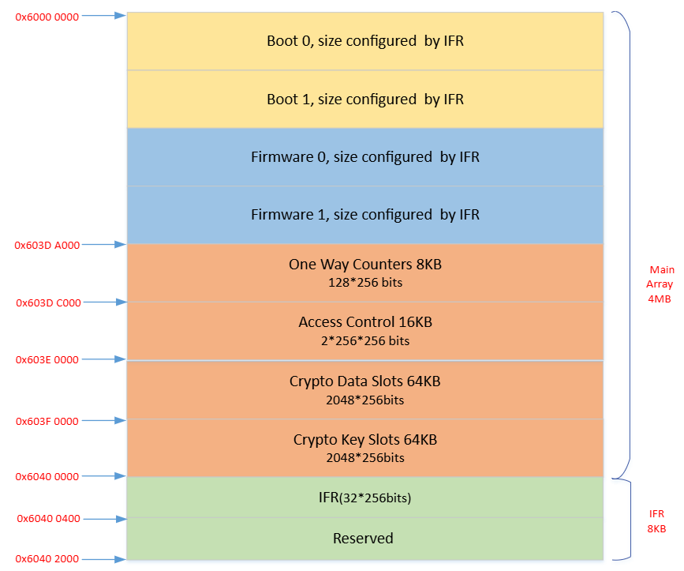
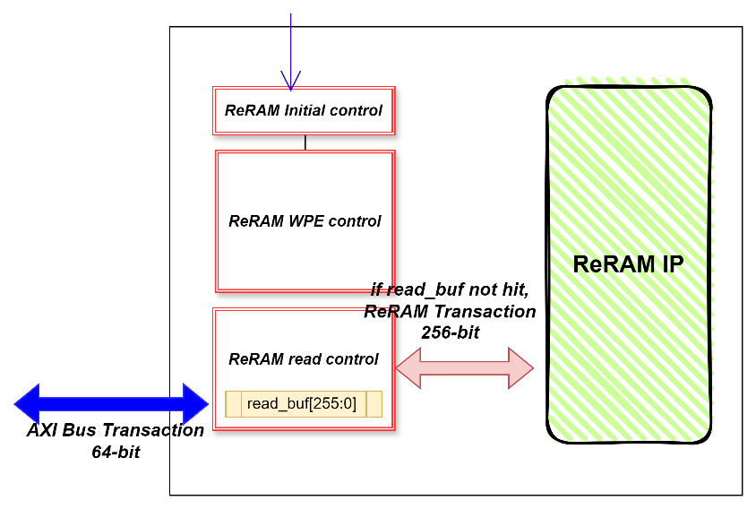
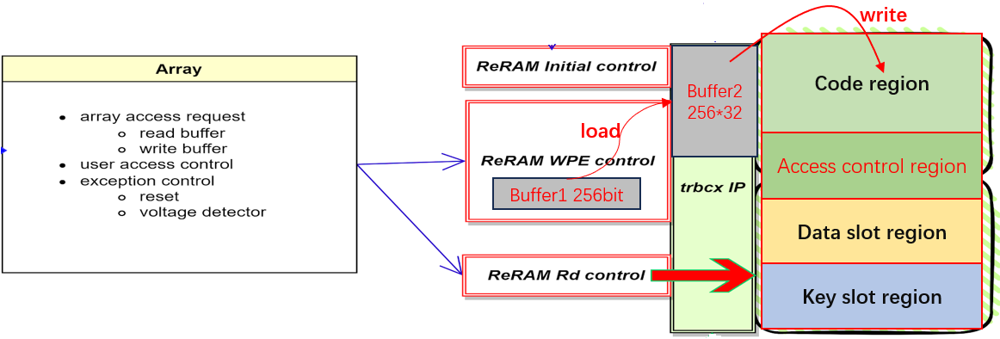
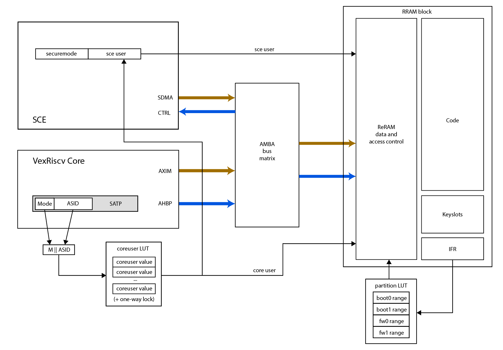
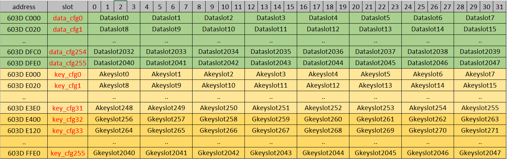

# Embedded ReRAM

## ReRAM Introduction

The chip features up to 4 MByte of embedded ReRAM memory for storing programs and data. The ReRAM memory contains two blocks of 128-bit data width each, giving 256-bit data width in parallel. The ReRAM memory visible to software is divided into two regions: the main array and the IFR array.

> **Note:** ReRAM reads back as zero if it was not initialized during the CP flow.

### ReRAM Memory Map

**Code region**

- Located at `0x6000_0000` to `0x603D_9FFF` (maximum extent).
- Up to 4 regions: boot0, boot1, fw0, fw1.
- Minimum 1 user.
- Configurable address region.
- Supports single write (256-bit) and page write (32 sets of 256-bit).

**One-way counters**

- Located at `0x603D_A000` to `0x603D_BFFF`.
- Only available in user mode.
- No user restrictions; write-only region.
- Software controls the number of writes — no more than 10 K writes per 256-bit word.
- Supports single write only.

**Access Control Bank**

- Located at `0x603D_C000` to `0x603D_FFFF`.
- Only available in user mode.
- Contains the access control configuration for key slots and data slots.
- Supports single write only, used to update access control configuration.

**Crypto Data Slots (2048 sets)**

- Located at `0x603E_0000` to `0x603E_FFFF`.
- Only available in user mode.
- Supports program-only or write operation.
- Provides user-writeable, set-only memory slots.
- Supports single and page write.

**Crypto Key Slots (2048 sets) — DEPRECATED**

- Located at `0x603F_0000` to `0x603F_FFFF`.
- Only available in user mode.
- Supports single and page write.
- **Do not use.** Deprecated due to a hardware bug.

**IFR (information region)**

- Located at `0x6040_0000` to `0x6040_03FF`.
- Configurable in user mode for lab testing and debug, but frozen for mass production and downloadable only in test mode.
- Holds the life cycle pattern.
- Holds chip system data: trimming, user mapping assignment, serial number.
- Holds read/write disable configuration for each key slot, data slot, and code block.
- Supports single write only.

### Data Slot Region Map (64 KB)

| Data slot | Size | Core address |
|-----------|------|--------------|
| Data slot 0 | 256 × 1 | `0x603E_0000` – `0x603E_001C` |
| Data slot 1 | 256 × 1 | `0x603E_0020` – `0x603E_003C` |
| … | … | … |
| Data slot 2046 | 256 × 1 | `0x603E_FFC0` – `0x603E_FFDC` |
| Data slot 2047 | 256 × 1 | `0x603E_FFE0` – `0x603E_FFFC` |

### Key Slot Region Map (64 KB)

This section has been removed because the key slot region is deprecated.

---

## ReRAM Read Mechanism

ReRAM supports 256-bit read data per transaction. The chip uses a single read buffer design to maximise instruction fetch performance. AXI bus transactions are 64-bit wide.

If the target read data is already prefetched into `read_buf[255:0]`, the ReRAM controller reads directly from the buffer with no wait states.

If the target read data is not in the read buffer, the ReRAM controller reads it from the ReRAM IP array and stores it into the read buffer, simultaneously returning the data on the AXI bus to the CPU cores.

Assuming one ReRAM array transaction provides 4 sets of contiguous 64-bit instructions, the average read time is `(6 × Period_rramclk + 3 × Period_aclk)`. This covers one 256-bit ReRAM access for the first 64-bit miss, plus the three subsequent 64-bit AXI bus transactions that hit in the buffer.

---

## ReRAM Write Mechanism

ReRAM supports multi-word write operations. The process has three steps: pre-load, load, and write.

**1. Pre-load step**

The CPU cores access ReRAM over the 64-bit AXI bus. Pre-load means using CPU writes to fill **one 256-bit write data Buffer1** over several transactions — for example 8 × 32-bit CPU writes, or 4 × 64-bit CPU writes.

**2. Load step**

After pre-load, the ReRAM IP requires the **Buffer1** data to be loaded into the trbcx module's **internal Buffer2**. Buffer2 can store N sets of 256-bit data, where N = 1 to 32.

**3. Write step**

After the load step, all write data is ready to be committed to the real ReRAM array. This step requires high voltage and a long process time.

### Write Timing

ReRAM write time depends on the difference between the originally stored data and the new write data. Average write times are:

**All 0 to All 1**

| | 1-word write | 32-word write |
|--|--------------|---------------|
| Average | ~50 µs | ~800 µs |
| Maximum | <100 µs | <1200 µs |

**All 1 to All 0 (worst-case pattern)**

| | 1-word write | 32-word write |
|--|--------------|---------------|
| Average | ~120 µs | ~1500 µs |
| Maximum | <200 µs | <2560 µs |

---

## RRC Registers

Base address: `0x4000_0000`

| Register Name | Offset | Size | Type | Access | Default | Description |
|---------------|--------|------|------|--------|---------|-------------|
| RRCCR | 0x0000 | 32 | CR | R/W | 0x00000000 | ReRAM control register |
| RRCFD | 0x0004 | 32 | CR | R/W | 0x00000007 | ReRAM clock configuration |
| RRCSR | 0x0008 | 32 | SR | R | 0x00000000 | ReRAM status probe (debug only) |
| RRCFR | 0x000C | 32 | FR | R | 0x00000000 | ReRAM access control error flag register |
| RRCSRSET0 | 0x0014 | 32 | SR | R | 0x00000000 | SET failure probe, bits \[31:0\] (debug only) |
| RRCSRSET1 | 0x0018 | 32 | SR | R | 0x00000000 | SET failure probe, bits \[63:32\] (debug only) |
| RRCSRRST0 | 0x001C | 32 | SR | R | 0x00000000 | RESET failure probe, bits \[31:0\] (debug only) |
| RRCSRRST1 | 0x0020 | 32 | SR | R | 0x00000000 | RESET failure probe, bits \[63:32\] (debug only) |
| RRCSRRD0 | 0x0024 | 32 | SR | R | 0x00000000 | Read failure probe, bits \[31:0\] (debug only) |
| RRCSRRD1 | 0x0028 | 32 | SR | R | 0x00000000 | Read failure probe, bits \[63:32\] (debug only) |
| RRCAR | 0x00F0 | 32 | AR | W | 0x00000000 | ReRAM suicide AR — limited use only |

### RRCCR — ReRAM Control Register

- **Address offset:** `0x0000`
- **Reset value:** `0x0000_0000`

| Bits | Field | Description |
|------|-------|-------------|
| \[0\] | low power mode | ReRAM IP low-power mode: `0` = nap, `1` = power down |
| \[1\] | access mode | ReRAM IP write access mode: `0` = data mode, `1` = command mode |
| \[9:2\] | — | Reserved |
| \[10\] | key_access_control | Key slot access control enable (disabled in A1 and later): `0` = disable, `1` = enable |
| \[11\] | data_access_control | Data slot access control enable (disabled in A1 and later): `0` = disable, `1` = enable |
| \[12\] | code_access_control | Code region access control enable (disabled in A1 and later): `0` = disable, `1` = enable |
| \[13\] | accfg_access_control | Access control cfg region access control enable (disabled in A1 and later): `0` = disable, `1` = enable |
| \[14\] | ifr_access_control | IFR region access control enable (disabled in A1 and later): `0` = disable, `1` = enable |
| \[15\] | rrc nmi enable | `0` = disable ReRAM controller access error NMI to system, `1` = enable |
| \[31:16\] | one-way counter event trigger enable | One bit per one-way counter: bit \[16\] enables `axi_one_way_counter 240` at `0x603D_BFC0`, through bit \[31\] enabling `axi_one_way_counter 255` at `0x603D_BFFC`. `0` = disable, `1` = enable. |

### RRCFD — ReRAM Clock Configuration Register

- **Address offset:** `0x0004`
- **Reset value:** `0x0000_0007`

| Bits | Field | Description |
|------|-------|-------------|
| \[4:0\] | fd | ReRAM IP working frequency (rramclk) divider |
| \[31:5\] | — | Reserved |

- rramclk should be typically 50 MHz, maximum 100 MHz.
- Software can adjust this value for different clktop frequencies to run ReRAM at the fastest supported speed.
- `frequency_rramclk = frequency_clktop / (fd + 1)`

Examples:

| Condition | clktop | rramclk |
|-----------|--------|---------|
| PLL disabled | 32 MHz (OSC) | 4 MHz |
| PLL enabled | 400 MHz (PLL) | 50 MHz |

### RRCSR — ReRAM Status Probe Register (Debug Only)

- **Description:** Internal trbcx IP status probe register
- **Address offset:** `0x0008`
- **Reset value:** `0x0000_0000`

| Bits | Field | Description |
|------|-------|-------------|
| \[0\] | trc_busy | `0` = idle, `1` = busy |
| \[4:1\] | trc_ip_cmd\[3:0\] | `4'h0` = idle, `4'h1` = read, `4'h2` = load, `4'h3` = write (HV operation), other = reserved |
| \[5\] | trc_info_lock_err | `0` = no info region lock error, `1` = error occurred |
| \[6\] | trc_err | `0` = no trc function error, `1` = error occurred |
| \[9:7\] | ecc_err | ECC error count (2C2D ECC supported): `3'b000` = error free, `3'b001` = 1-bit error, `3'b010` = 2-bit error, `3'b100` = reserved |
| \[31:10\] | — | Reserved |

If no exception occurs, these bits stay at 0.

### RRCFR — ReRAM Access Control Error Flag Register

- **Address offset:** `0x000C`
- **Reset value:** `0x0000_0000`

Write `1` to a bit to clear it.

| Bits | Field | Description |
|------|-------|-------------|
| \[0\] | key_access_err | `1` = invalid key slot access occurred, error interrupt raised |
| \[1\] | data_access_err | `1` = invalid data slot access occurred, error interrupt raised |
| \[2\] | code_access_err | `1` = invalid code region access occurred, error interrupt raised |
| \[3\] | cfg_access_err | `1` = invalid access control cfg region access occurred, error interrupt raised |
| \[4\] | ifr_access_err | `1` = invalid IFR region access occurred, error interrupt raised |
| \[31:5\] | — | Reserved |

### RRCSRSET0 / RRCSRSET1 — SET Failure Probe Registers (Debug Only)

- **Address offsets:** `0x0014` (bits \[31:0\]), `0x0018` (bits \[63:32\])
- **Reset value:** `0x0000_0000`

Probes `trc_set_failure[63:0]` — the count of "program 1" failure bits for a page operation. If no exception occurs, these bits stay at 0.

### RRCSRRST0 / RRCSRRST1 — RESET Failure Probe Registers (Debug Only)

- **Address offsets:** `0x001C` (bits \[31:0\]), `0x0020` (bits \[63:32\])
- **Reset value:** `0x0000_0000`

Probes `trc_reset_failure[63:0]` — the count of "erase 0" failure bits for a page operation. If no exception occurs, these bits stay at 0.

### RRCSRRD0 / RRCSRRD1 — Read Failure Probe Registers (Debug Only)

- **Address offsets:** `0x0024` (bits \[31:0\]), `0x0028` (bits \[63:32\])
- **Reset value:** `0x0000_0000`

Probes `trc_fourth_read_failure[63:0]` — the count of "write 0/1" failure bits for a page operation. If no exception occurs, these bits stay at 0.

### RRCAR — ReRAM Action Register

- **Address offset:** `0x00F0`
- **Type:** AR (action register, write-only)
- **Reset value:** `0x0000_0000` (always reads zero)

| Bits | Field | Description |
|------|-------|-------------|
| \[31:0\] | — | Write `PM_RRAM_SUICIDE` (`0x0000_2468`) to initiate a suicide flow, erasing all ReRAM |

> **Note:** This register is for limited use only and is not required in every product application. Whether this function is exposed to external users is determined by the product's security level.

---

## ReRAM Access Control Mechanism

The chip provides two paths to access ReRAM memory: the CPU core can access ReRAM directly, and the SCE DMA master can access ReRAM through the AXI bus.

When the CPU accesses ReRAM, it also supplies the coreuser ID to the ReRAM controller, identifying the "user" performing the access (note that this only applies to loads/stores; code accesses can bypass this due to a bug in the implementation, and this is patched through the MMU). The ReRAM controller matches this user against its access configuration to determine whether the user may access the target ReRAM address region.

ReRAM has four effective "users": boot0, boot1, fw0, and fw1. These users appear in two contexts:

1. As one of four possible owners encoded in an ACL for a data slot. Here the region is determined strictly by the coding in the data slot's ACL.
2. As regions determined by the address of the access. Here the region is coded in the IFR, a hard-coded value set at manufacturing time into the ReRAM array.

For the Baochip-1x, the region mapping uses the following offsets from the base of ReRAM:

| User | Offset range |
|------|--------------|
| boot0 | `0x0000_0000` – `0x0002_0000` |
| boot1 | `0x0002_0000` – `0x0006_0000` |
| fw0 & fw1 | `0x0006_0000` – `0x0040_0000` |

The partition LUT matters because a separate IFR setting (`cfg_rrsub_rw_boot0`, at offset `0x280`) prevents boot0 from being written, effectively making boot0 indelible outside of boot0 itself.

The actual mapping of the coreuser LUT is set up by the bootloader and sealed with a one-way lock after exiting the boot stage. The default configuration can be found in the Xous code base. In short, all `M||ASID` mappings are set to a "least trusted" user mapping, except for the combination of fw1 + user mode. (User mode as opposed to machine/supervisor mode — in other words, only a particular user-mode process can access the key slots; even the kernel, in machine/supervisor mode, cannot see them.) That combination maps to PID 3, where the keystore process is mapped on boot in Xous. Because the one-way door is sealed on exit from the bootloader, modifying this table requires a custom bootloader.

The SDMA master uses a similar method, supplying the `sce_user` ID to the ReRAM controller to identify the user performing the access through SDMA.

Access control covers code execution, data read, and data write operations, with different restrictions depending on the target operation.

All access control functions can be enabled independently via the `RRCCR` register. If an error occurs, an interrupt is generated and the corresponding flag bit is set in `RRCFR`. If the NMI function is enabled (`RRCCR[15]`), the error flag generates both an NMI and a normal interrupt. See [RRC Registers](#rrc-registers) for details.

### Memory Size Configuration

The ReRAM memory region configuration is located in IFR at `0x6040_00C0`. The bit definitions are as follows.

**ReRAM array size settings**

| Bits | Field |
|------|-------|
| \[127:120\] | ReRAM start |
| \[119:112\] | ReRAM end |

- Default value: `0x00FF`, meaning the whole ReRAM is used.
- ReRAM start address = `{10'b0110_0000_00, bit[127:120], 14'h0}`
- ReRAM last address = `{10'b0110_0000_00, bit[119:112], 14'h3FFF}`

**CM7 user region settings**

| Bits | Field |
|------|-------|
| \[111:104\] | CM7 init (IV) |
| \[103:96\] | boot0 start |
| \[95:88\] | boot1 start |
| \[87:80\] | fw0 start |
| \[79:72\] | fw1 start |
| \[71:64\] | fw1 end |

- Default value: `0x0000_FFFF_FFFF`, meaning only boot0 is used.
- boot0 start address = `{10'b0110_0000_00, bit[103:96], 14'h0}`
- boot0 last address = `{10'b0110_0000_00, bit[95:88], 14'h3FFF}`
- The CM7 init address should match the software power-on start address — usually the boot0 or boot1 start address.

**RISC-V user region settings**

| Bits | Field |
|------|-------|
| \[63:56\] | rv init |
| \[55:48\] | boot0 start |
| \[47:40\] | boot1 start |
| \[39:32\] | fw0 start |
| \[31:24\] | fw1 start |
| \[23:16\] | fw1 end |

Bit definitions mirror the CM7 fields above.

Usage guidance:

- **Single core (RISC-V only):** this value can be set freely according to application requirements.
- **Multiple cores** (not supported by Baochip; available on Crossbar SKUs):
  1. The CM7 settings are used instead of these settings — set bits \[63:16\] the same as bits \[111:64\].
  2. The software design should treat the RISC-V core as its own user, and that user cannot also be used by the CM7 core, since the two cores' instruction sets are not compatible. The RISC-V default user (bits \[1:0\]) should be set to match the software design.
  3. If both CM7 and RISC-V use the same user, the ReRAM controller cannot distinguish between them and treats them as the same user. In that case only one core can access ReRAM at any given time.

**SRAM array size settings**

| Bits | Field |
|------|-------|
| \[15:12\] | SRAM1 size reduction settings |
| \[11:8\] | SRAM0 size reduction settings |

SRAM1 (bits \[15:12\]):

- bit \[7\]: size cut enable
- bits \[6:4\]: size range
- Default `0x0`: disabled, no size reduction.
- If enabled, the valid SRAM1 address range is `< {bit[6:4], 15'h0}`.

SRAM0 (bits \[11:8\]):

- bit \[3\]: size cut enable
- bits \[2:0\]: size range
- Default `0x0`: disabled, no size reduction.
- If enabled, the valid SRAM0 address range is `< {bit[2:0], 15'h0}`.

**Other user-related settings**

| Bits | Field | Description |
|------|-------|-------------|
| \[7:5\] | user_trustkey_enable | bit \[5\] = boot1 user, bit \[6\] = fw0 user, bit \[7\] = fw1 user. Default `0x0`: high-level security code certificate disabled. |
| \[2\] | RISC-V default mm | RISC-V core default machine mode setting |
| \[1:0\] | RISC-V default user | `0` = boot0, `1` = boot1, `2` = fw0, `3` = fw1 |

**Reserved bits**

| Bits | Note |
|------|------|
| \[255:128\] | Reserved for CP testing use only. Always write 0. |
| \[15:8\] | Reserved. Always write 0. |
| \[4:3\] | Reserved. Always write 0. |

### Data Access to Code Region

The ReRAM data access control for the code region is configured in the IFR. Each user has its own configuration settings.

In all tables below, the default value is `0`, meaning access is always allowed. Setting a bit to `1` disables that access. `Y` indicates access is always permitted (a user always has access to its own region).

**boot0 configuration** — IFR `0x6040_0280`, bits \[111:104\] (`user_code_cfg_boot0`)

| Operation | boot0 | boot1 | fw0 | fw1 |
|-----------|-------|-------|-----|-----|
| Read boot0 | Y | bit \[106\] | bit \[108\] | bit \[110\] |
| Write boot0 | Y | bit \[107\] | bit \[109\] | bit \[111\] |

**boot1 configuration** — IFR `0x6040_02A0`, bits \[111:104\] (`user_code_cfg_boot1`)

| Operation | boot0 | boot1 | fw0 | fw1 |
|-----------|-------|-------|-----|-----|
| Read boot1 | bit \[104\] | Y | bit \[108\] | bit \[110\] |
| Write boot1 | bit \[105\] | Y | bit \[109\] | bit \[111\] |

**fw0 configuration** — IFR `0x6040_02C0`, bits \[111:104\] (`user_code_cfg_fw0`)

| Operation | boot0 | boot1 | fw0 | fw1 |
|-----------|-------|-------|-----|-----|
| Read fw0 | bit \[104\] | bit \[106\] | Y | bit \[110\] |
| Write fw0 | bit \[105\] | bit \[107\] | Y | bit \[111\] |

**fw1 configuration** — IFR `0x6040_02E0`, bits \[111:104\] (`user_code_cfg_fw1`)

| Operation | boot0 | boot1 | fw0 | fw1 |
|-----------|-------|-------|-----|-----|
| Read fw1 | bit \[104\] | bit \[106\] | bit \[108\] | Y |
| Write fw1 | bit \[105\] | bit \[107\] | bit \[109\] | Y |

In each case, all other bits are reserved for CP testing only and should always be written as 0.

### Data Access to One-Way Counter Region

As with a general MCU, there is no access restriction on the one-way counter region for any user. Each one-way counter should be written fewer than 10 K times.

### Data Access to Access Control Region

This region can only be accessed by privileged users (boot0 and boot1). It stores the access control configuration for all data slots and key slots. Each data slot or key slot has its own 32-bit access control configuration.

**Data slot control region**

- Each item controls access to the corresponding slot in the Data Slots region. See [Data slot access control configuration word](#data-slot-access-control-configuration-word-32-bit).
- Size: 2048 × 4 = 8 KB
- Address: `0x603D_C000` – `0x603D_DFFF`

**Key slot control region**

- Each item controls access to the corresponding slot in the Key Slots region.
- Size: 2048 × 4 = 8 KB
- Address: `0x603D_E000` – `0x603D_FFFF`
- Akey: authentication link root key, which controls Gkey access.

> **Note:** The key slot region is deprecated. See [Data access control to key slot region](#data-access-control-to-key-slot-region).

#### data_cfg Slot (256-bit)

Each `data_cfg` slot holds access control configuration for **8 data slots**. Each data slot has its own 32 bits of configuration.

For `data_cfg` slot N, the bit assignment is:

| Bits | Controls |
|------|----------|
| \[31:0\] | data slot (0 + N×8) |
| \[63:32\] | data slot (1 + N×8) |
| \[95:64\] | data slot (2 + N×8) |
| \[127:96\] | data slot (3 + N×8) |
| \[159:128\] | data slot (4 + N×8) |
| \[191:160\] | data slot (5 + N×8) |
| \[223:192\] | data slot (6 + N×8) |
| \[255:224\] | data slot (7 + N×8) |

**Read access control bits for the cfg slots** — located at IFR `0x6040_0300` and `0x6040_0320`:

| IFR address | Bit | Controls |
|-------------|-----|----------|
| `0x6040_0300` | \[0\] | read control, data_cfg0 slot |
| `0x6040_0300` | … | … |
| `0x6040_0300` | \[127\] | read control, data_cfg127 slot |
| `0x6040_0320` | \[0\] | read control, data_cfg128 slot |
| `0x6040_0320` | … | … |
| `0x6040_0320` | \[127\] | read control, data_cfg255 slot |

Default `0` means read is always allowed. Setting the bit to `1` disables read access.

**Write access control bits for the cfg slots** — located at IFR `0x6040_0340` and `0x6040_0360`:

| IFR address | Bit | Controls |
|-------------|-----|----------|
| `0x6040_0340` | \[0\] | write control, data_cfg0 slot |
| `0x6040_0340` | … | … |
| `0x6040_0340` | \[127\] | write control, data_cfg127 slot |
| `0x6040_0360` | \[0\] | write control, data_cfg128 slot |
| `0x6040_0360` | … | … |
| `0x6040_0360` | \[127\] | write control, data_cfg255 slot |

Default `0` means write is always allowed. Setting the bit to `1` disables write access.

#### key_cfg Slot (256-bit)

These slots are deprecated and should not be used, as they are not fully functional.

#### Data Slot Access Control Configuration Word (32-bit)

| Bits | Field | Description |
|------|-------|-------------|
| \[0\] | core_rd_dis | Core read disable. Default `0` = read enabled. |
| \[1\] | core_wr_dis | Core write disable. Default `0` = write enabled. |
| \[2\] | sce_rd_dis | SCE read disable. Default `0` = read enabled. |
| \[3\] | sce_wr_dis | SCE write disable. Default `0` = write enabled. |
| \[7:4\] | — | Reserved |
| \[15:8\] | seg_id\[7:0\] | SCE algorithm ID; must match the software design. For an HMAC certificate, set to `8'h1F`. Otherwise set to match the SCE register definitions: SCE GDMA `XCHCR_SEGID` at `0x4002_901C`, SCE SDMA `SCHCR_SEGID` at `0x4002_903C`. These registers are defined by software. |
| \[23:16\] | slot_owner\[7:0\] | bit \[7\] = fw1, bit \[6\] = fw0, bit \[5\] = boot1, bit \[4\] = boot0. Bits \[3:0\] reserved. |
| \[24\] | write mode | `0` = write (0→1, 1→0, both), `1` = program-only (0→1 only). This bit is configuration only; for how to invoke the operation on the data slot region see [ReRAM operation reference flow](#rram-operation-reference-flow). |
| \[31:25\] | — | Reserved |

### Data Access Control to Data Slot Region

The data slot region can be accessed by different masters. Crypto applications normally require a higher-privilege user mode to access a data slot.

| Master | User mode | Slot owner | segid | rd_dis | wr_dis | Access |
|--------|-----------|------------|-------|--------|--------|--------|
| x.Read | x | NO_OWNER, SHARED | x | 0 | x | allow |
| x.Write | x | NO_OWNER, SHARED | x | x | 0 | allow |
| CM7.CORE.Read | privilege | = cm7_coreuser | x | 0 | x | allow |
| CM7.CORE.Write | privilege | = cm7_coreuser | x | x | 0 | allow |
| RV.CORE.Read | machine | = rv_coreuser | x | 0 | x | allow |
| RV.CORE.Write | machine | = rv_coreuser | x | x | 0 | allow |
| SCE.Read | exclusive/secure | = sce_user | match | 0 | x | allow |
| SCE.Write | exclusive/secure | = sce_user | match | x | 0 | allow |

Any other operation is denied.

### Data Access Control to Key Slot Region

This mode of operation is deprecated, as it has hardware bugs.

### Data Access Control to IFR Region

The IFR region stores system-level configuration.

Before mass production, skipping the "disable write access" step allows software to access the IFR region during lab testing or sample testing. **This region can be accessed by privileged users (boot0 and boot1) for debug and development purposes only.**

Software does not need to perform its own access control. The final settings should be downloaded and the write access datapath then disabled, **under test mode or OEM mode**, during the CP or FT process. Users cannot modify IFR settings in mass production.

Detailed CP and FT testing steps are described in the *Daric NTO Test Mode User Guide*.

---

## ReRAM Operation Reference Flow

### Regular ReRAM Write Operation Flow

1. Set `RRCCR[1] = 0` (power-on default) to select data mode for the input write data.
2. Write 256 bits into internal write Buffer1 — either 8 × 32-bit writes or 4 × 64-bit writes to the ReRAM address.
3. Set `RRCCR[1] = 1` to select command mode for the LOAD or WRITE command.
4. Write the LOAD command (`0x5200`) to the ReRAM address.
5. Single write or page write is supported: 1 to 32 loads of 256 bits to the same ReRAM page.
6. For multiple 256-bit loads, repeat steps 2–4 for each target data value and address.
7. Write the WRITE command (`0x9528`) to the ReRAM address.
8. Read back the ReRAM address to confirm the write succeeded.

### Special ReRAM One-Way Counter Operation Flow

1. Valid only for the one-way counter address region.
2. Write any value (the data is ignored) directly to the target one-way counter address, like a single SRAM write.
3. Read back the one-way counter address to obtain the counter value.

### Special ReRAM Program-Only Operation Flow

1. Valid only for the data slots region, 256-bit, with program-only configuration enabled.
2. Only single write operations are supported, one at a time.
3. Set `RRCCR[1] = 0` (power-on default) to select data mode for the input write data.
4. Write 256 bits into the internal write buffer — either 8 × 32-bit writes or 4 × 64-bit writes to the ReRAM program-only address.
5. Set `RRCCR[1] = 1` to select command mode and start the PROG operation. **Only bits written as `1` in the 256-bit value are programmed into the ReRAM.**
6. Write any value (the data is ignored) directly to the target program-only address, like a single SRAM write.
7. Read back the ReRAM address to confirm the program succeeded.

Example:

| Stage | Value |
|-------|-------|
| Before the program-only operation | `0x5555_5555_…_5555` (all `0x5` nibbles) |
| Write data | `0xAAAA_AAAA_…_AAAA` (all `0xA` nibbles) |
| After the program-only operation | `0xFFFF_FFFF_…_FFFF` (all `0xF` nibbles) |

Because program-only sets bits but never clears them, the result is the bitwise OR of the original contents and the write data.

### Special ReRAM Access Control Region Update Flow

1. Read the original value of the target access control slot.
2. Modify the specific bits to change the access control settings.
3. Use the regular ReRAM single write operation flow to write the new configuration into the target access control slot. The internal logic also updates the internal access control SRAM buffer, so the new setting takes effect immediately.
4. Read back the target ReRAM address to confirm the update succeeded.
