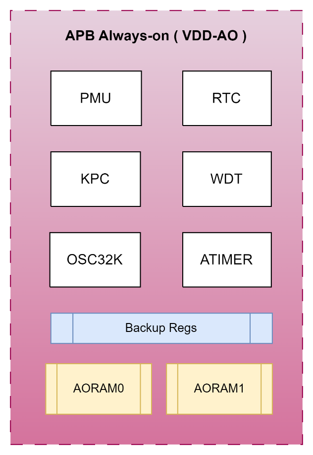
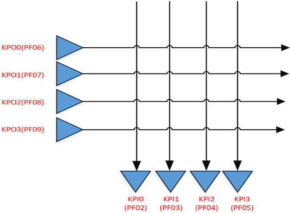
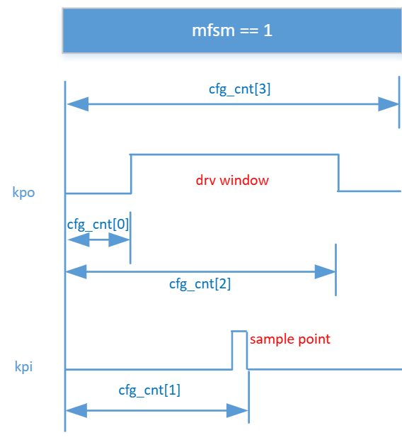
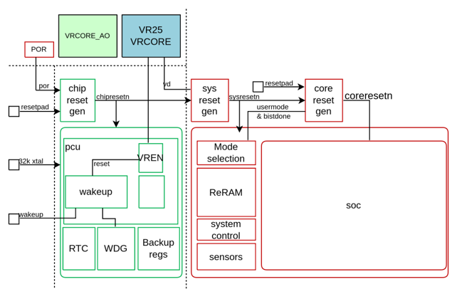
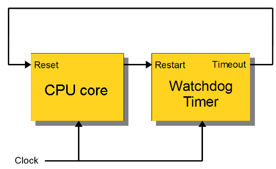

# System Control (Always-On)

## Always-On Domain Overview

The Always-On (AO) power domain manages the power-on sequence and remains powered in all operating modes until the chip is completely shut down. It handles activity monitoring to wake up the SoC whenever needed, and manages power supply sequencing during initial power-on or any power mode transition.

The AO domain contains the following logic blocks:

- **PMU** — Power management unit. Controls power domains of the SoC subsystem, manages wake-up triggers to recover from sleep mode, and supports separate trimmings and enables (power-on autoloaded from ReRAM IFR; SW-configurable for debug). See the [PMU](pmu.md) chapter for full details.
- **KPC** — Keypad controller. Supports keypad function and can wake the chip from low-power mode. Activating this overrides PF0 functions for the respective pins.
- **RTC** — Real-time clock associated with a 32 kHz oscillator (external XTAL or internal RC).
- **WDT** — Watchdog timer. Consistent with the SoC-domain WDT peripheral; see the [Watchdog Timer](#watchdog-timer-wdt) section below.
- **ATimer** — Always-on timer. Consistent with the SoC-domain ATimer peripheral; see the [ATimer](#atimer) section below.
- **BUREG** — Backup registers in AO domain. Contents are retained during SoC power-down. Size: 32 bytes. Located at `0x4006_5000`–`0x4006_501F`. Wake-up via interrupt will preserve the contents; wake-up by system reset will clear the contents.
- **RAM** — AO domain RAM. Contents retained during SoC power-down. Split into 2 blocks. Size: 16 KBytes. Located at `0x5030_0000`–`0x5030_3FFF`.
- **IO PAD** — Port F is the special I/O pad group used in the AO domain. PF\[1:0\] support GPIO and wakeup. PF\[9:2\] support GPIO and keypad function but do not support wakeup.
- **Interrupts:**
  - IRQ 30: AO domain interrupt entry — keypad async input, keypad synced interrupt, watchdog interrupt, ATimer interrupt, RTC interrupt, watchdog reset (6 sources total).
  - IRQ 31: AO wakeup interrupt entry — same 6 sources as IRQ 30, plus PF\[1:0\] pad inputs (8 sources total).

**AO domain address map:**

| Block | Base Address |
|-------|-------------|
| PMU | `0x4006_0000` |
| RTC | `0x4006_1000` |
| KPC | `0x4006_4000` |
| AOBUREG | `0x4006_5000` |
| AORAM | `0x5030_0000` |
| WDT | `0x4004_1000` |
| ATimer | `0x4004_3000` |

### AORAM Erratum

AORAM data at 0x50300000 and 0x50302000 have chance to be reset to 0 during/after VDD85D and VDD33 power cycle.

Do not use the 32-bit words located at 0x50300000 or 0x50302000 for data storage that must be preserved across deep sleep modes.

---

## PMU

The PMU (Power Management Unit) is part of the AO domain and is responsible for managing all SoC power supplies and power-mode transitions.

Full PMU documentation — including the block diagram, regulator descriptions, power mode control flow, and all AO control register descriptions — is covered in the [PMU](pmu.md) chapter.

---

## RTC

### RTC Introduction

The RTC uses a 1 Hz clock signal (CLK1HZ) to increment a counter in one-second intervals, supporting real-time clock and basic alarm functionality in software.

After reset, values must be written to the Load Register (`RTC_LR`) and Match Register (`RTC_MR`). The counter increments by 1 on the rising edge of CLK1HZ. When the counter matches the match register and the interrupt is not masked, an interrupt is generated. The interrupt is cleared by writing 1 to `RTC_ICR`.

### RTC Main Features

- 32-bit free-running up counter.
- Programmable 32-bit match compare register.
- Software-maskable interrupt when counter and match registers are identical.

### RTC Interrupt

- Single maskable interrupt `RTCINTR`, generated on counter/match equality.
- Enable or disable via bit \[0\] of `RTC_IMSC`.
- Read mask status from bit \[0\] of `RTC_MIS`.
- Clear by writing 1 to bit \[0\] of `RTC_ICR`.
- IRQn: 30

### RTC Registers

Base address: `0x4006_1000`

| Register | Offset | Size | Type | Access | Default | Description |
|----------|--------|------|------|--------|---------|-------------|
| RTC_DR | 0x0000 | 32 | CR | R | 0x00000000 | RTC data register |
| RTC_MR | 0x0004 | 32 | CR | R/W | 0x00000000 | RTC match register |
| RTC_LR | 0x0008 | 32 | CR | R/W | 0x00000000 | RTC load register |
| RTC_CR | 0x000C | 32 | CR | R/W | 0x00000000 | RTC control register |
| RTC_IMSC | 0x0010 | 32 | CR | R/W | 0x00000000 | Interrupt mask set/clear |
| RTC_RIS | 0x0014 | 32 | CR | R | 0x00000000 | Raw interrupt status |
| RTC_MIS | 0x0018 | 32 | CR | R | 0x00000000 | Masked interrupt status |
| RTC_ICR | 0x001C | 32 | CR | W | 0x00000000 | Interrupt clear register |

#### RTC_DR — RTC Data Register

- **Address offset:** `0x0000`
- **Access:** R

| Bits | Field | Description |
|------|-------|-------------|
| \[31:0\] | RTC_Data | Current RTC counter value. Reads return the current value of the running counter. |

#### RTC_MR — RTC Match Register

- **Address offset:** `0x0004`
- **Access:** R/W

| Bits | Field | Description |
|------|-------|-------------|
| \[31:0\] | RTC_Match | 32-bit match register. An equivalent match value is derived and compared with the counter in the CLK1HZ domain to generate the interrupt. Reads return the last written value. |

#### RTC_LR — RTC Load Register

- **Address offset:** `0x0008`
- **Access:** R/W

| Bits | Field | Description |
|------|-------|-------------|
| \[31:0\] | RTC_Load | Writes load a new value into the RTC update logic, from which the new counter value is calculated. Reads return the last written value. |

#### RTC_CR — RTC Control Register

- **Address offset:** `0x000C`
- **Access:** R/W

| Bits | Field | Description |
|------|-------|-------------|
| \[31:1\] | — | Reserved. Must be written as 0. |
| \[0\] | RTC start | `1` = RTC enabled. Do not write this bit again after enabling or the counter resets to zero. Read returns current RTC running status. |

#### RTC_IMSC — Interrupt Mask Set/Clear Register

- **Address offset:** `0x0010`
- **Access:** R/W

| Bits | Field | Description |
|------|-------|-------------|
| \[31:1\] | — | Reserved. Must be written as 0. |
| \[0\] | Interrupt mask | `0` = interrupt stopped, `1` = interrupt enabled. Read returns current mask value for RTCINTR. |

#### RTC_RIS — Raw Interrupt Status Register

- **Address offset:** `0x0014`
- **Access:** R

| Bits | Field | Description |
|------|-------|-------------|
| \[31:1\] | — | Reserved. |
| \[0\] | Raw status | Raw interrupt state of RTCINTR before masking. Write has no effect. |

#### RTC_MIS — Masked Interrupt Status Register

- **Address offset:** `0x0018`
- **Access:** R

| Bits | Field | Description |
|------|-------|-------------|
| \[31:1\] | — | Reserved. |
| \[0\] | Masked status | Masked interrupt state of RTCINTR after applying mask. Write has no effect. |

#### RTC_ICR — Interrupt Clear Register

- **Address offset:** `0x001C`
- **Access:** W (write-only)

| Bits | Field | Description |
|------|-------|-------------|
| \[31:1\] | — | Reserved. |
| \[0\] | Clear | Write `1` to clear the RTCINTR interrupt flag. Write `0` has no effect. |

---

## KPC (Keypad Controller)

### KPC Introduction

The keypad controller supports a 4×4 keyboard matrix using 4 KPO (output) rows and 4 KPI (input) columns. It monitors the keypad array, detects node rise or fall events, and reports status in `KPC_SR`.

Note that when the KPC mappings are activated, they will override any GPIO configuration for the PF bank. This also impacts the PA pins that are tied to the PF bank - it is important for the system designer & programmer to ensure no conflicts on these pins, otherwise excessive power draw can result during sleep mode.

For example, if PA0 is configured to drive high, the KPC will drive PF9 (regradless of whether KPO3 is used by the system or not), and this combination will effectively short the high-drive of PA0 onto the KPC's low-pulse scan of the keyboard matrix.

**Node ID mapping:**

| | KPI0 | KPI1 | KPI2 | KPI3 |
|--|------|------|------|------|
| **KPO0** | 0 | 1 | 2 | 3 |
| **KPO1** | 4 | 5 | 6 | 7 |
| **KPO2** | 8 | 9 | 10 | 11 |
| **KPO3** | 12 | 13 | 14 | 15 |

- Port F (PF9–PF2) is dedicated to the keypad function. Use the [`AO_IOX`](pmu.md#ao_iox--port-f-alternate-function-selection-register) and [`AO_PADPU`](pmu.md#ao_padpu--port-f-pull-up-configuration-register) registers for function selection and pull-up configuration.
- Clock source is clk32k, divisible to 1 ms via `KPC_CFG1`.
- Keypad sampling timing is configured via `KPC_CFG2`:

### KPC Main Features

- Auto-sleep mode; sleep time configured via `KPC_CFG4`.
- Each node individually configurable for rise or fall event generation via `KPC_CFG3`.
- Multiple simultaneous node events supported via FIFO; indicated in `KPC_SR1`.
- Per-node status readable from `KPC_SR0`.

### KPC Interrupt

- Configure node rise/fall event generation via `KPC_CFG3`.
- Enable AO interrupt via the `KPCINTR` bit in `AO_WKUP_INTEN` (see [PMU](pmu.md#ao_wkup_inten--wakeup-mask-and-interrupt-enable)).
- Event flags in `KPC_FF`.
- IRQn: 30

### KPC Registers

Base address: `0x4006_4000`

| Register | Offset | Size | Type | Access | Default | Description |
|----------|--------|------|------|--------|---------|-------------|
| KPC_CFG0 | 0x0000 | 32 | CR | R/W | 0x0000000D | Enable configuration |
| KPC_CFG1 | 0x0004 | 32 | CR | R/W | 0x001F1010 | Time configuration |
| KPC_CFG2 | 0x0008 | 32 | CR | R/W | 0xFF201810 | Sample timing configuration |
| KPC_CFG3 | 0x000C | 32 | CR | R/W | 0xFFFFFFFF | Node event configuration |
| KPC_SR0 | 0x0010 | 32 | SR | R | 0x00000000 | Status register 0 |
| KPC_SR1 | 0x0014 | 32 | SR | R | 0x00000000 | Status register 1 |
| KPC_FF | 0x0020 | 32 | CR | W | 0x00000000 | Event FIFO |
| KPC_CFG4 | 0x0030 | 32 | CR | R/W | 0x000001F4 | Sleep wait time configuration |

#### KPC_CFG0 — KPC Enable Configuration Register

- **Address offset:** `0x0000`
- **Reset value:** `0x0000_000D`

| Bits | Field | Description |
|------|-------|-------------|
| \[5\] | autosleep enable | Auto-sleep enable |
| \[4\] | kpc enable | KPC enable |
| \[3\] | KPOOE1 | KPO output enable |
| \[2\] | KPOOE0 | KPO output disable |
| \[1\] | KPOPO1 | KPO pull-up enable |
| \[0\] | KPOPO0 | KPO pull-up disable |

#### KPC_CFG1 — KPC Time Configuration Register

- **Address offset:** `0x0004`
- **Reset value:** `0x001F_1010`

| Bits | Field | Description |
|------|-------|-------------|
| \[23:16\] | Cfg_cnt1ms | Timer configuration for 1 ms @ clk32k |
| \[15:8\] | Cfg_filter | Filter value, based on mfsm round |
| \[7:0\] | Cfg_step | Basic time unit |

#### KPC_CFG2 — KPC Sample Timing Configuration Register

- **Address offset:** `0x0008`
- **Reset value:** `0xFF20_1810`

| Bits | Field | Description |
|------|-------|-------------|
| \[31:24\] | cfg_cnt3 | Time interval between each KPOx line |
| \[23:16\] | cfg_cnt2 | Time to stop driving KPOx |
| \[15:8\] | cfg_cnt1 | Time of KPIx sample point |
| \[7:0\] | cfg_cnt0 | Time to start driving KPOx |

#### KPC_CFG3 — KPC Node Configuration Register

- **Address offset:** `0x000C`
- **Reset value:** `0xFFFF_FFFF`

| Bits | Field | Description |
|------|-------|-------------|
| \[31:16\] | Fall event enable | Bit N enables fall event/interrupt for node N (nodes 0–15) |
| \[15:0\] | Rise event enable | Bit N enables rise event/interrupt for node N (nodes 0–15) |

#### KPC_SR0 — KPC Status Register 0

- **Address offset:** `0x0010`
- **Reset value:** `0x0000_0000`
- **Access:** R

| Bits | Field | Description |
|------|-------|-------------|
| \[19\] | KPI\[3\].pi | KPI3 current input state |
| \[18\] | KPI\[2\].pi | KPI2 current input state |
| \[17\] | KPI\[1\].pi | KPI1 current input state |
| \[16\] | KPI\[0\].pi | KPI0 current input state |
| \[15:0\] | Node status | Current state of keypad nodes 0–15 |

#### KPC_SR1 — KPC Status Register 1

- **Address offset:** `0x0014`
- **Reset value:** `0x0000_0000`
- **Access:** R

| Bits | Field | Description |
|------|-------|-------------|
| \[0\] | FIFO valid | `1` = event FIFO contains a valid entry |

#### KPC_FF — KPC Event FIFO Register

- **Address offset:** `0x0020`
- **Reset value:** `0x0000_0000`
- **Access:** W

| Bits | Field | Description |
|------|-------|-------------|
| \[31:16\] | evtiming | Event timing in 10 ms units, measured from last event |
| \[4:0\] | event index | `0`–`15` = node 0–15 rise event; `16`–`31` = node 0–15 fall event |

#### KPC_CFG4 — KPC Sleep Wait Time Configuration Register

- **Address offset:** `0x0030`
- **Reset value:** `0x0000_01F4`

| Bits | Field | Description |
|------|-------|-------------|
| \[15:0\] | cfg_deep10ms | Timer configuration for 10 ms @ clk32k (auto-sleep wait time) |

---

## ATimer

### ATimer Main Features

- 2 general-purpose 32-bit upwards counters (Lo and Hi).
- Selectable clock source per counter:
  - PCLK
  - 32 kHz always-on clock
- 8-bit programmable prescaler (divides clock frequency).
- Counting modes:
  - **One-shot:** timer stops after the first compare match.
  - **Continuous:** timer continues counting after a match.
  - **64-bit cascaded:** both 32-bit timers used as a single 64-bit timer.

### ATimer Interrupts

- ATimer0 (Lo) IRQn: 27
- ATimer1 (Hi) IRQn: 28

### ATimer Registers

Base address: `0x4004_3000`

| Register | Offset | Size | Type | Access | Default | Description |
|----------|--------|------|------|--------|---------|-------------|
| TIMER_CFG_LO | 0x0000 | 32 | CR | R/W | 0x00000000 | Timer Low configuration |
| TIMER_CFG_HO | 0x0004 | 32 | CR | R/W | 0x00000000 | Timer High configuration |
| TIMER_CNT_LO | 0x0008 | 32 | CR | R/W | 0x00000000 | Timer Low counter value |
| TIMER_CNT_HO | 0x000C | 32 | CR | R/W | 0x00000000 | Timer High counter value |
| TIMER_CMP_LO | 0x0010 | 32 | CR | R/W | 0x00000000 | Timer Low comparator value |
| TIMER_CMP_HO | 0x0014 | 32 | CR | R/W | 0x00000000 | Timer High comparator value |
| TIMER_START_LO | 0x0018 | 32 | CR | R/W | 0x00000000 | Start Timer Low |
| TIMER_START_HO | 0x001C | 32 | CR | R/W | 0x00000000 | Start Timer High |
| TIMER_RESET_LO | 0x0020 | 32 | CR | R/W | 0x00000000 | Reset Timer Low counter |
| TIMER_RESET_HO | 0x0024 | 32 | CR | R/W | 0x00000000 | Reset Timer High counter |

#### TIMER_CFG_LO — Timer Low Configuration Register

- **Address offset:** `0x0000`
- **Reset value:** `0x0000_0000`

| Bits | Field | Description |
|------|-------|-------------|
| \[31\] | CASC | Cascaded 64-bit mode enable: combines Timer Lo and Timer Hi into a single 64-bit timer |
| \[15:8\] | PVAL | Prescaler value. `ftimer = fclk / (1 + PVAL)` |
| \[7\] | CCFG | Clock source: `0` = PCLK, `1` = 32 kHz reference clock |
| \[6\] | PEN | Prescaler enable |
| \[5\] | ONES | One-shot mode: `0` = timer stays enabled after compare match, `1` = timer disabled after compare match |
| \[4\] | MODE | Continuous mode: `0` = continue incrementing after match, `1` = reset counter after match |
| \[2\] | IRQEN | Interrupt enable on compare match |
| \[1\] | RST | Reset timer (self-clearing after reset completes) |
| \[0\] | EN | Timer enable (starts counting) |

#### TIMER_CFG_HO — Timer High Configuration Register

- **Address offset:** `0x0004`
- **Reset value:** `0x0000_0000`

Same bit layout as `TIMER_CFG_LO`, except:

| Bits | Field | Description |
|------|-------|-------------|
| \[7\] | CCFG | Clock source: `0` = FLL or FLL + prescaler, `1` = 32 kHz reference clock |

All other fields (PVAL, PEN, ONES, MODE, IRQEN, RST, EN) are the same as `TIMER_CFG_LO` but apply to Timer Hi. Note: CASC bit \[31\] is only present in `TIMER_CFG_LO`.

#### TIMER_CNT_LO / TIMER_CNT_HO — Counter Value Registers

- **Offsets:** `0x0008` (Lo), `0x000C` (Hi)
- **Reset value:** `0x0000_0000`

| Bits | Field | Description |
|------|-------|-------------|
| \[31:0\] | CNT | Current 32-bit counter value for the respective timer |

#### TIMER_CMP_LO / TIMER_CMP_HO — Comparator Value Registers

- **Offsets:** `0x0010` (Lo), `0x0014` (Hi)
- **Reset value:** `0x0000_0000`

| Bits | Field | Description |
|------|-------|-------------|
| \[31:0\] | CMP | 32-bit compare value. Interrupt is generated when the counter matches this value. |

#### TIMER_START_LO / TIMER_START_HO — Timer Start Registers

- **Offsets:** `0x0018` (Lo), `0x001C` (Hi)
- **Reset value:** `0x0000_0000`

| Bits | Field | Description |
|------|-------|-------------|
| \[0\] | S | Write `1` to start the timer (sets the EN bit in the corresponding `TIMER_CFG` register) |

#### TIMER_RESET_LO / TIMER_RESET_HO — Timer Reset Registers

- **Offsets:** `0x0020` (Lo), `0x0024` (Hi)
- **Reset value:** `0x0000_0000`

| Bits | Field | Description |
|------|-------|-------------|
| \[0\] | R | Write `1` to reset the counter (sets the RST bit in the corresponding `TIMER_CFG` register) |

---

## RCU (Reset Controller Unit)

### RCU Introduction

### RCU Main Features

Generates local and system resets from several sources:

- POR — Power-on reset
- Reset pad pin (XRSTn)
- Supply voltage failure on VDD
- Watchdog timeout
- Wake-up event
- Software command

### RCU Registers

Base address: `0x4004_0080`

| Register | Offset | Size | Type | Access | Default | Description |
|----------|--------|------|------|--------|---------|-------------|
| RCURST0 | 0x0000 | 32 | AR | W | — | Write `0x000055AA` to reset chip system |
| RCURST1 | 0x0004 | 32 | AR | W | — | Write `0x000055AA` to reset core system |
| RCUSRCFR | 0x0008 | 32 | SR | R | 0x00000000 | Reset source flags |

#### RCURST0 — Chip System Reset Register

- **Address offset:** `0x0000`
- **Type:** AR (action register, write-only)

| Bits | Field | Description |
|------|-------|-------------|
| \[31:0\] | — | Write `0x0000_55AA` to trigger a chip system reset |

#### RCURST1 — Core System Reset Register

- **Address offset:** `0x0004`
- **Type:** AR (action register, write-only)

| Bits | Field | Description |
|------|-------|-------------|
| \[31:0\] | — | Write `0x0000_55AA` to trigger a core system reset |

#### RCUSRCFR — Reset Source Flag Register

- **Address offset:** `0x0008`
- **Reset value:** `0x0000_0000`
- **Access:** R

Only bits \[8:0\] are valid. A `1` in a bit indicates that reset source occurred. Bits \[15:9\] are reserved — ignore any `1` values read there.

System reset sources:

| Bits | Field | Description |
|------|-------|-------------|
| \[8\] | chipresetn | Chip-level reset |
| \[7\] | vdresetn | Voltage detector reset |
| \[6\] | secresetn | Security warning reset |
| \[5\] | sysreset_sw | Software reset via `RCURST0` |

Core reset sources:

| Bits | Field | Description |
|------|-------|-------------|
| \[4\] | padresetn | XRST pad reset |
| \[3\] | sysresetn | System reset |
| \[2\] | cmsresetn | Chip mode reset |
| \[1\] | wdtresetn | Watchdog reset |
| \[0\] | corereset_sw | Software reset via `RCURST1` |

---

## Watchdog Timer (WDT)

### WDT Introduction

The Watchdog Timer (WDT) detects software faults by automatically generating a system reset or interrupt if the CPU fails to service the watchdog within a programmed interval.

- **Time-out mode:** If the CPU does not restart the watchdog within the configured interval, the WDT asserts a reset signal to the ARM core.
- **Feeding the dog:** Software must periodically write to `WDT_CLR` to restart the counter. Failure to do so within the interval causes a core reset.

### WDT Interrupt

- IRQn: 29

### WDT Registers

Base address: `0x4004_1000`

| Register | Offset | Size | Type | Access | Default | Description |
|----------|--------|------|------|--------|---------|-------------|
| WDT_VAL | 0x0000 | 32 | CR | R/W | 0xFFFFFFFF | Counter load value |
| WDT_CNT | 0x0004 | 32 | SR | R | 0xFFFFFFFF | Current counter value |
| WDT_CFG | 0x0008 | 32 | CR | R/W | 0x00000000 | Configuration |
| WDT_CLR | 0x000C | 32 | AR | W | — | Clear (feed) counter |
| WDT_INTRAW | 0x0010 | 32 | SR | R | 0x00000000 | Raw interrupt status (unmasked) |
| WDT_INT | 0x0014 | 32 | SR | R | 0x00000000 | Masked interrupt status |
| WDT_LOCKCR | 0x0C00 | 32 | CR | R/W | 0x00000000 | Register lock control |
| WDT_ITCR | 0x0F00 | 32 | CR | R/W | 0x00000000 | Internal test enable |
| WDT_ITOP | 0x0F04 | 32 | CR | R/W | 0x00000000 | Internal test operate |

#### WDT_VAL — Counter Load Value Register

- **Address offset:** `0x0000`
- **Reset value:** `0xFFFF_FFFF`

| Bits | Field | Description |
|------|-------|-------------|
| \[31:0\] | WDT_VAL | Value loaded into the counter. Write to set the timeout interval. |

#### WDT_CNT — Counter Register

- **Address offset:** `0x0004`
- **Reset value:** `0xFFFF_FFFF`
- **Access:** R

| Bits | Field | Description |
|------|-------|-------------|
| \[31:0\] | WDT_CNT | Current counter value (counts down) |

#### WDT_CFG — Configuration Register

- **Address offset:** `0x0008`
- **Reset value:** `0x0000_0000`

| Bits | Field | Description |
|------|-------|-------------|
| \[1\] | RST | Reset enable: `1` = assert reset on timeout |
| \[0\] | IRQ | Interrupt enable: `1` = generate interrupt on timeout |

#### WDT_CLR — Clear Counter Register

- **Address offset:** `0x000C`
- **Type:** AR (action register, write-only)

| Bits | Field | Description |
|------|-------|-------------|
| \[31:0\] | — | Write any value to restart the watchdog counter (feed the dog) |

#### WDT_INTRAW — Raw Interrupt Status Register

- **Address offset:** `0x0010`
- **Reset value:** `0x0000_0000`
- **Access:** R

| Bits | Field | Description |
|------|-------|-------------|
| \[31:0\] | — | Raw (unmasked) interrupt status |

#### WDT_INT — Masked Interrupt Status Register

- **Address offset:** `0x0014`
- **Reset value:** `0x0000_0000`
- **Access:** R

| Bits | Field | Description |
|------|-------|-------------|
| \[31:0\] | — | Masked interrupt status |

#### WDT_LOCKCR — Register Lock Control Register

- **Address offset:** `0x0C00`
- **Reset value:** `0x0000_0000`

| Bits | Field | Description |
|------|-------|-------------|
| \[31:0\] | VAL | Write `0x1ACE_E551` to unlock all WDT registers. Write any other value to lock them (registers become read-only). Bit \[0\] reads `1` when locked. |

#### WDT_ITCR — Internal Test Configuration Register

- **Address offset:** `0x0F00`
- **Reset value:** `0x0000_0000`

| Bits | Field | Description |
|------|-------|-------------|
| \[0\] | en | Internal test mode enable |

#### WDT_ITOP — Internal Test Operate Register

- **Address offset:** `0x0F04`
- **Reset value:** `0x0000_0000`

| Bits | Field | Description |
|------|-------|-------------|
| \[1\] | irq | Generate watchdog IRQ (test mode) |
| \[0\] | rst | Generate watchdog reset (test mode) |
